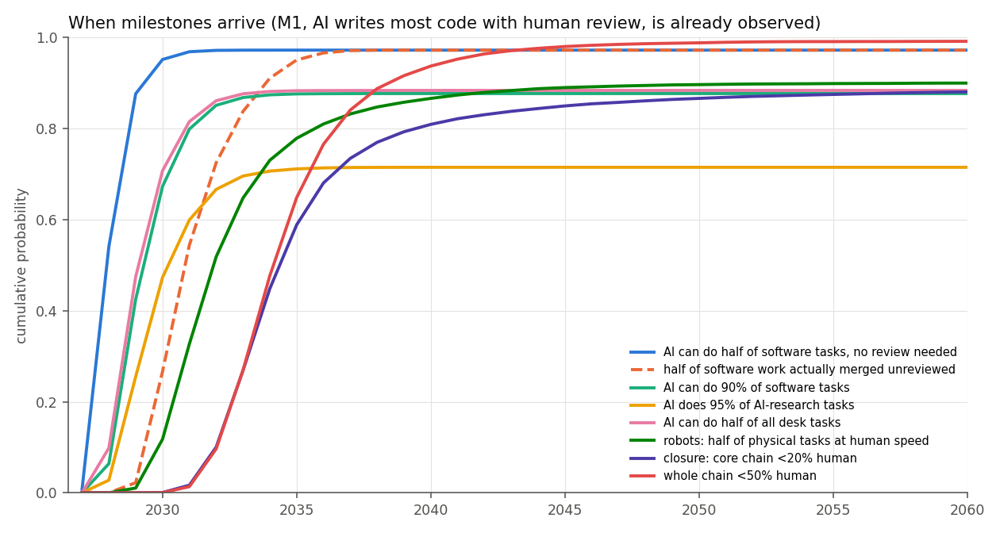
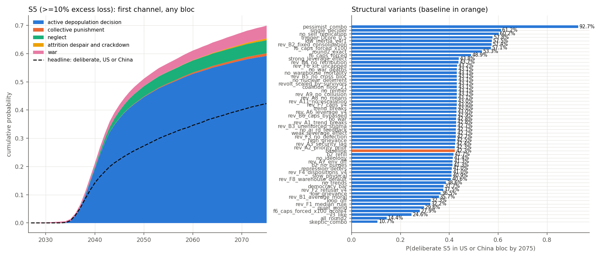
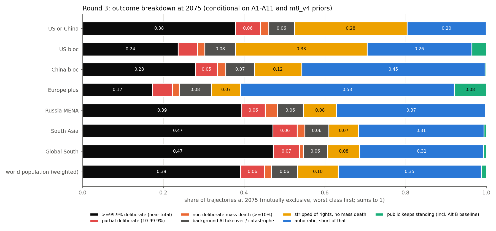
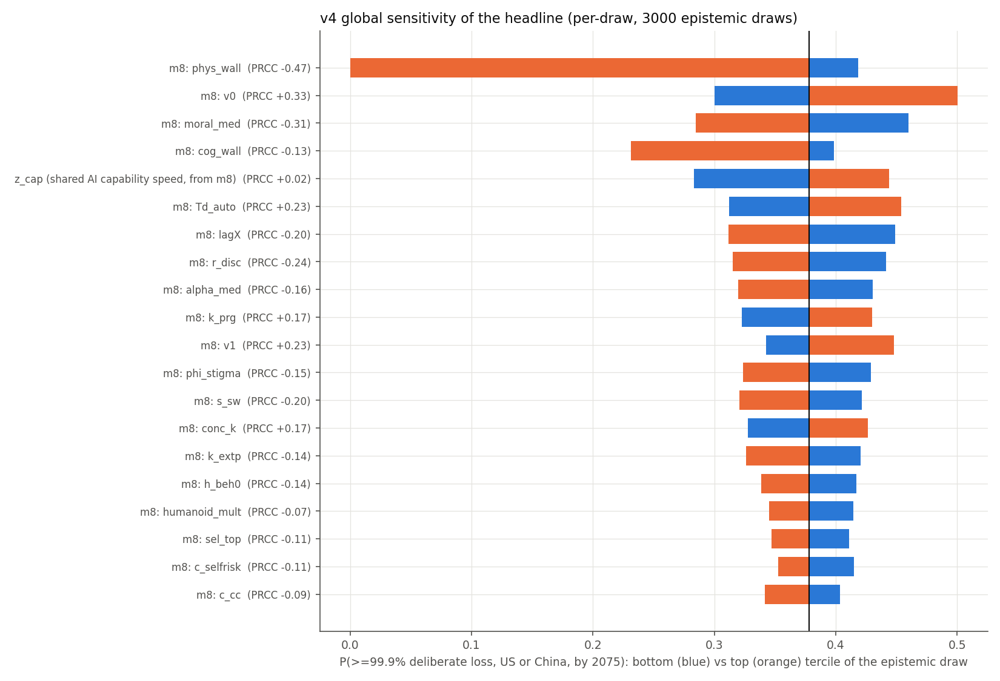
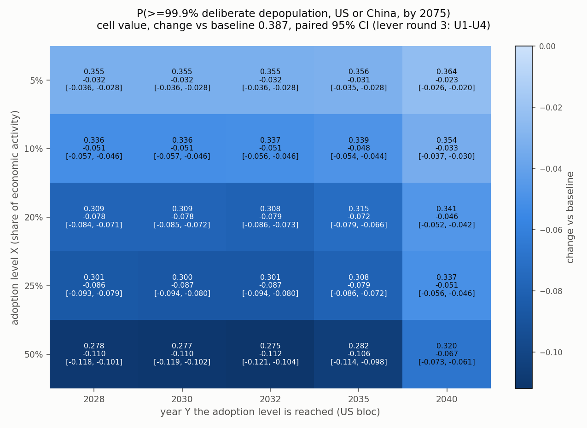

# Losing Leverage: A Game-Theoretic Simulation of Power After Full Automation

**Eight Rice** (contact@autonet.computer; ORCID 0009-0008-2902-0845)

*Draft, October 2026. Code, data and results: https://github.com/autonet-code/leverage-sims. All numbers in this paper are reproducible from the code with the seeds given in Appendix D.*

---

## Abstract

Throughout history, rulers have needed large numbers of people: to work, to pay taxes and to enforce orders. That need is what made them bargain with, feed and fear their populations. If AI and robots can do nearly all productive and military work, the need may disappear. This paper asks what protects people once it does.

We built a game-theoretic Monte Carlo simulation of six world blocs from 2026 to 2075. It tracks:
- AI capability and robot build-out;
- the loss of the public's economic and military leverage;
- the erosion of democracy;
- purges inside ruling groups;
- the choices those groups make once their populations are no longer needed.

It draws on historical base rates and includes four restraints on rulers found by a search of the historical record with rules fixed in advance. We cross-checked it against a pre-specified elicitation from a judgment model.

Like war games and the scenario side of climate research, the model cannot predict when events will happen. It can compare futures and show which assumptions drive them. We report it that way.

**Main findings:**
1. **Losing leverage removes the public's protection, and nothing structural replaces it.** By 2075 the US or China public is disempowered in 94% of runs, counting plain autocracy, and stripped of rights or worse in 73%.
2. **The outcome then rests on a few people.** Once the public has no leverage, what decides whether rulers escalate to mass killing is their own restraint, incentives and internal politics, which no data measure.
3. **The result does not hinge on how closure is reached.** Building a dedicated automated loop instead of converting the existing economy brought closure about 2.5 years earlier but left the risk of mass killing almost unchanged. Faster AI progress does raise the risk.
4. **One intervention changes the incentives.** An economic network outside state and corporate control that pays its output to households makes it almost free for rulers to keep people alive. If it carries 50% of US-bloc economic activity by the early 2030s, the risk of near-total depopulation falls by more than a quarter, and by about half for the period to 2050. Arriving in 2040 loses about 40% of that effect.

**Where the assumptions lead.** The results hold under seventeen stated assumptions: eleven that define the scenario and six that ground ruling-group behavior in evidence. Under them:
- people stop being needed in the leading bloc by a median year of 2034;
- the probability of a deliberate loss of 10% or more of the US or China bloc's population by 2075 is about 0.44;
- the probability that such a loss reaches 99.9% or more (roughly 8 billion people to 8 million) is about 0.38 for the US or China bloc and 0.09 for the world.

The near-total level rests on one assumption: that rulers who have started killing fear the survivors and finish the job. Without it, no run passes 99.9%. These probabilities are far above published expert and superforecaster estimates. The model's rate of lethal policy within 15 years of closure is also 1.7 to 2.4 times the judgment model's. They show where the assumptions lead, not a forecast.

---

## Key findings

*All findings below are model results under the assumptions in Section 4. The comparisons (what changes the outcome, and by how much) are more robust than the absolute probabilities and dates.*

1. **People lose their leverage in the early-to-mid 2030s.**
   - We call the point where a bloc's core supply chain needs less than 20% of its 2026 human labor **closure**. The first bloc reaches it in a median year of 2034.0 (10th to 90th percentile 2032.0 to 2039.25, among runs where closure occurs).
   - Democracy erodes as leverage goes. In the US bloc, democracy breaks down by 2040 in 63% of runs. Across all blocs, only 26% of first post-closure decisions are taken while the deciding bloc is still a democracy.
2. **No ruling group chooses depopulation first. It arises through escalation.**
   - First choices after closure are to keep the status quo, to serve the public, or to **warehouse** people (minimal provision and no role in the economy).
   - Under unrest and fear of the survivors, 36% of warehousing regimes later escalate to killing.
3. **Near-total depopulation has a probability of more than one in three.** The probability of a deliberate loss of 99.9% or more is:
   - 0.378 for the US or China bloc by 2075;
   - 0.223 by 2050;
   - 0.607 for at least one of six blocs.

   Without the threat-elimination assumption (A11), no run reaches 99.9%. A deliberate loss of 10% or more stays at a little more than two in five (0.44).
4. **Loss of standing is nearly universal.** By 2075, the US or China public is stripped of rights or worse in 73% of runs, and disempowered, counting plain autocracy, in 94%. Prolonged disempowerment is a catastrophe in its own right, not only a step toward mass killing.
5. **The outcome hinges on a few people.**
   - By 2075, the leader holds 95% or more of coercive control in 58% of US-or-China runs.
   - Across plausible parameter values, the middle 95% of estimates runs from 0.02 to 0.95. Given assumptions A4 to A6, which remove the public's leverage, what decides a run is the moral restraint, incentives and purge behavior of the ruling group.
6. **A parallel economy based on human labor alone does not protect people.**
   - People trading among themselves outside the automated economy end as a tolerated community in about 0.2% of runs.
   - After closure, they have nothing the automated side needs.
7. **An income network independent of the state lowers the risk substantially.**
   - It does so by paying households directly. It needs to be large by the early 2030s.
   - 20% of economic activity buys about 70% of the effect of 50%, and even 5% helps.
   - It does not prevent crackdowns or change who controls force, and a probability of about 0.28 remains.
   - We do not assess whether such adoption is achievable. It is far above historical diffusion rates.

---

## Disclosures

**Competing interests.** The author develops Autonet, a decentralized AI project of the general kind tested in Section 6.2. The network in Section 6.2 is modeled as a generic class of system defined only by its effects, not as Autonet or any other specific product. The author has no affiliation with TypeSafe, the maker of the Jev judgment model.

**Use of AI tools.** AI tools assisted with coding, and source checking; the author is responsible for all content.

---

## 1 Introduction

### 1.1 The scenario

The hypothesis we test is a chain of events, each step ordinary on its own:

1. **Firms automate because their competitors do.** Profits concentrate in a few AI providers.
2. **Broad economic participation collapses.** As people lose income, consumer businesses lose customers. Business-to-business firms follow a little later.
3. **Displaced people protest, then revolt.** They cannot threaten a state whose force is automated and whose tax base is the AI firms.
4. **Rulers ask why they should keep paying for people they do not need.** People become mouths to feed, and loud ones. Depopulation can be justified internally as an ecological reset or as kindness.
5. **Partial measures leave survivors who remember.** Survivors are witnesses and potential avengers, inside a bloc and across borders. This logic pushes toward near-total reduction, with a small captive remnant kept without rights.

We ask three questions. How likely is this chain under explicit assumptions? When would it happen? Which links drive it?

### 1.2 Why this is worth modeling

Most quantitative work on catastrophic AI risk studies misaligned AI: systems that pursue goals their builders did not intend (Ord 2020; Carlsmith 2022). Economic work studies job loss and growth. The mechanism here is different. The AI works as intended, and humans direct it. The danger comes from the people at the top no longer needing everyone else.

This mechanism has been described qualitatively:
- *The Intelligence Curse* (Drago and Laine 2025);
- *Gradual Disempowerment* (Kulveit et al. 2025);
- *AI-Enabled Coups* (Davidson, Finnveden and Hadshar 2025).

We found no published quantitative model of it. Empirical work so far measures milder effects. For example, AI surveillance in China helps the state suppress protest (Beraja et al. 2023). This paper is a first attempt at a full quantitative model.

### 1.3 How to read the numbers

Every probability in this paper is conditional on the assumptions in Section 4. Each is stated plainly, so a reader can reject one and see roughly what follows. Section 5.8 and Appendix E.5 remove threat elimination (A11), each of the six behavioral assumptions (B1 to B6), the environment trends (A7), the means of mass killing (A8), collusion (A9) and several mechanisms. They also revert A1, A2, A3 and A6 to earlier, milder forms. A4 and A5 are not tested by removal, for these reasons:
- **A4.** Once force is automated, refusal by the people who carry out orders no longer applies, and nearly every path to the outcome requires closure (Section 5.3). Keeping humans in the loop of automated force is a policy lever (Section 6.1).
- **A5.** Keeping a safety net is also a policy choice, and it is not current reality.

Section 8.5 (item 3) reports the related model checks.

---

## 2 The core argument: why people have power, and how automation removes it

Rulers have always depended on large numbers of people. They needed farmers to grow food, workers to make goods, taxpayers to fund the state, and soldiers and police to enforce orders. That dependence gave ordinary people leverage in three forms.

1. **Labor leverage.** People can stop working. Strikes, slowdowns and emigration impose costs that rulers must weigh.
2. **Revolt leverage.** People can fight. A regime that faces a credible uprising must bargain or repress, and repression needs enforcers.
3. **Enforcer leverage.** The enforcers are people too. Soldiers can refuse to fire, and police can defect. Most dictators who lose power by unconstitutional means are removed by insiders: 205 of 316 between 1946 and 2008 (Svolik 2012). Campaigns facing a violent crackdown were more than four times as likely to succeed when security forces defected (Stephan and Chenoweth 2008).

Democracy, welfare and the rule of law grew where these forms of leverage were strong. They were not gifts but bargains that rulers accepted because the alternative cost more. This is the core claim of several literatures:
- selectorate theory (Bueno de Mesquita et al. 2003);
- economic theories of democratization (Acemoglu and Robinson 2006);
- work on how taxation built modern states (Tilly 1990).

Under assumptions A1 to A4, automation removes all three forms of leverage:
- When AI and robots run the core supply chain (mining, energy, chips, manufacturing, logistics, construction, maintenance), labor leverage goes.
- When security is automated, revolt leverage goes. A crowd cannot overpower a fleet of drones, and drones do not need to be persuaded.
- When no human operator stands behind each weapon, enforcer leverage goes. The only people left who could refuse are the handful who authorize operations at the top.

**The key structural point.** None of this requires rulers to be unusually cruel. It requires only that the costs and benefits they face change.
- **Today**, keeping a population fed and housed is cheaper than the alternative, and the population is needed anyway.
- **After closure**, keeping people costs resources, land and the risk of unrest, and returns nothing the rulers need.

What happens then depends on the restraint of the people in charge. The historical record of people who have held unchecked power gives little reason for comfort (Section 4.2).

---

## 3 Method

### 3.1 Three lines of evidence

1. **Historical and empirical base rates.** We used the best available data for each link:

   | Domain | Source |
   |---|---|
   | AI capability trends | METR task-horizon measurements (Kwa et al. 2025) |
   | Robot production | IFR (2025) |
   | Compute shares | Epoch AI (2025) |
   | Military spending | SIPRI (2025) |
   | Democratic erosion | V-Dem (Nord et al. 2026) |
   | Obedience and refusal | Milgram (1974) and replications (Haslam, Loughnan and Perry 2014; Burger 2009); Browning (1992) |
   | Elite purges | Sudduth (2017), Goldring |
   | Mass killing | Harff (2003), Valentino, Huth and Balch-Lindsay (2004), Straus (2006) |

   Current policy trajectories, as of September 2026, set the starting conditions.
2. **A game-theoretic Monte Carlo simulation.** Six blocs evolve year by year. In each bloc, a ruling group of individually simulated members (not modeled on real people) weighs:
   - the value of freed land and resources;
   - their own moral cost;
   - the threat of revolt;
   - outside pressure that someone can actually enforce;
   - the power of rival blocs.

   Grievance, insurgency, democratic erosion, purges, war and cross-border campaigns arise inside the model rather than being imposed.
3. **A judgment model as a cross-check.** Jev (TypeSafe) is a language model designed to give calibrated probability judgments. We fixed the design before sending any query and committed it to the repository: 648 scenario cells, each asked in 3 paraphrases, plus a 648-cell control arm in which humans still do 80% of the work, for 3,888 queries in total.

   We did not calibrate the simulation's outputs to Jev. Jev does inform two inputs:
   - the share of elites who refuse to order killing, mixed with historical priors;
   - the effect of provision on revolt, as a 0.6 / 0.4 mixture of historical evidence and Jev.

   Everywhere else, Jev serves only as a check, mainly on which factors raise or lower risk.

### 3.2 The simulation in brief

**Blocs** (populations from UN DESA 2024).

| Bloc | Members | Population 2026 |
|---|---|---|
| US bloc | US, Japan, South Korea, Taiwan | 0.53 bn |
| China bloc | China | 1.42 bn |
| Europe plus | EU, UK, Canada, Australia, New Zealand, Switzerland, Norway | 0.62 bn |
| Russia and MENA | Russia, Middle East, North Africa | 0.99 bn |
| South Asia | | 1.97 bn |
| Global South | Remaining countries | 2.67 bn |

Each bloc has these parts:

1. **An economy of nine segments**: mining, energy, chips, manufacturing, logistics, construction, maintenance, security and administration. Each segment's automated share grows with AI capability and robot supply. The limits on that growth are:
   - robots building robots;
   - energy;
   - chip fabrication;
   - mining;
   - the bloc's share of world input supply.
2. **A human-dependence index.** This is the share of the core supply chain's 2026 human labor that is still needed, counting labor embedded in imports. Closure is the point where it falls below 20%. Section 4.4 describes how a dedicated automated loop enters this index.
3. **A public.** Displacement and cuts to provision raise grievance. Grievance raises hostility, and hostility raises the yearly chance of insurgency (we call such yearly rates **hazards**). Insurgency drives repression.
4. **A democracy score** on the V-Dem liberal democracy scale. It falls as the public's labor and revolt leverage fall. We count a score below 0.30 as a breakdown, roughly Hungary in 2024 or Turkey in 2015.
5. **A ruling coalition.** In autocracies it has up to 21 members; in democracies, a wider elite of 51 decides through veto players. Each member has:
   - a moral cost of ordering killing;
   - a degree of concern for the public;
   - a discount rate;
   - a share of control over coercive force.

   Members can purge each other, and purges can trigger counter-coups. A leader who holds half or more of coercive control rules alone. The inner circle can still block a decision, but its chance of success falls as automation grows.
6. **Military power.** This depends on military spending, economic output and the automated share of security.

**Choices.** After closure, each ruling coalition repeatedly chooses among six options, from mildest to harshest:
1. serve the public;
2. live off rents;
3. keep the status quo;
4. warehouse people;
5. neglect them;
6. depopulate.

How a regime decides depends on its type:
- **Democracies** need near-unanimity among 3 to 5 veto players (Tsebelis 2002). Their number shrinks as democracy erodes.
- **Oligarchies** need a 50 to 67% supermajority for a harsher move, with each member's vote weighted by their control of force.
- **A personalist leader** decides alone, subject to the inner-circle veto.

**Endgame.** The simulation tracks deaths from five channels:
1. executed depopulation orders;
2. economic strangulation and neglect;
3. an abstract means of rapid mass killing, whose availability rises with AI capability (no operational detail is modeled);
4. war, including war between coalitions that have both chosen depopulation, up to nuclear exchange;
5. cross-border campaigns against blocs that cannot resist.

Only three things can stop a campaign: a successful revolt, a repelled attack, or nuclear retaliation.

**Scenario tree.** The bloc simulation sits inside a broader scenario tree, which adds three things:
- **Earlier stages.** These are the automation race, the collapse of broad economic participation, and broad repression by regimes still staffed by humans.
- **Background catastrophes.** AI takeover not directed by rulers and non-AI global catastrophe are competing end points. A run that hits one first is not counted toward depopulation.
- **A counterfactual US history.** If the US first becomes a broadly repressive regime, the model continues from a world in which the US is autocratic at closure, for all six blocs.

### 3.3 Sample size and what the intervals mean

The main run draws 3,000 sets of uncertain parameter values (we call each set a **draw**). Each draw is run for 200 paths spread over 8 random seeds, giving 3,000 x 200 = 600,000 simulated futures from October 2026 to the end of 2075. We report three kinds of interval:

1. **Simulation error** (bootstrap 95% interval). This shows how precisely the sample pins down the average. For the headline it is 0.366 to 0.391.
2. **Parameter spread** (95% range of per-draw probabilities). This shows how much the answer depends on which plausible parameter values are true. For the headline it is 0.021 to 0.951.
3. **Structural range.** This is the spread across 46 alternative model versions. It runs from 0.000 (threat elimination switched off) to 0.875 (every pessimistic option switched on).

**What the precision means.** The small simulation error says nothing about accuracy. The headline is an average over judgment priors, and shifting those priors shifts it. Per-draw values are close to all-or-nothing: a draw's parameters either permit an executed order or they do not. We therefore quote "about 0.38" in the text and keep three decimals for tables.

### 3.4 Evidence labels

Every parameter is labeled by the kind of evidence behind it:
- measured;
- strong analog;
- weak analog;
- judgment.

Where a situation has no historical precedent, the parameter gets a wide range. It is never pushed toward zero because the situation is new. The whole scenario is unprecedented: populations have never lost both their economic and their military relevance.

Gaps are filled with documented human tendencies:
- in-group and out-group behavior;
- dehumanization and moral disengagement (Bandura 1999);
- elite self-interest;
- the over-representation of people with weak moral restraint among those who hold unchecked power.

Appendix A lists the key parameters with their labels. Supplement S1 lists all of them.

### 3.5 Verification

- **Independent audit.** An audit reran the full pipeline of the version without brakes and reproduced its headline numbers exactly.
- **Backward compatibility.** With the brakes switched off, the code reproduces the version without brakes exactly. Switching off B1 to B6 as well reproduces the version before them exactly. With the three structural changes of Section 4.4 switched off, the code reproduces the brakes-only version exactly (0.36744 and 0.08784).
- **CPU and GPU.** The GPU and CPU implementations agree within simulation error.
- **Bookkeeping.** Outcome categories sum to one, loss thresholds are nested correctly, and deaths are not double counted across blocs.

The bookkeeping bugs found by the final two audits are listed in Appendix C. None changed the headline by more than 0.002. Earlier design errors, which did change results, are listed there too.

---

## 4 Assumptions

### 4.1 Scenario assumptions

These eleven assumptions define the scenario. They were fixed before the final runs.

**A1. AI capability keeps growing exponentially, and the growth can speed up.**
- The length of task AI can complete on its own has doubled about every four months since 2023. Averaged over 2019 to 2025, it doubled about every seven months (METR; Kwa et al. 2025).
- The doubling time can shrink further as AI speeds up AI research.
- In the model, faster AI progress can only bring closure earlier, never later.

**A2. Physical automation is a top priority in the US and China from 2026.** Robot output grows exponentially. It is limited only by how fast robots can build robots and by documented physical limits.

**A3. Security automation needs no separate investment and gets priority.** Military and police automation has no separate, slower curve. It follows from general capability and robot supply, and security gets first claim on that supply.

**A4. Refusal by soldiers and police stops mattering once autonomous systems are fielded at scale.**
- No human operator stands behind each drone. Autonomous targeting is already used in Ukraine.
- The only refusal that still counts is among the few people who authorize operations at the top.
- Repression aimed at reducing numbers needs no checkpoints or detention, and therefore no human staff.
- In the model, switching off defection by security forces leaves the headline almost unchanged (0.378 against 0.384 at the same sample size), because security is largely automated before any decision is taken.

**A5. There is no safety net by default.** Provision starts on the 2026 trajectory of cuts. In the US, the 2025 reconciliation act cuts federal Medicaid spending by about $911 billion and food assistance by about $186 billion over ten years. The Congressional Budget Office expects 10 million more people to be uninsured by 2034 (CBO 2025). Keeping people fed is a choice rulers must actively make, and cheaper production does not imply willingness to provide.

**A6. Power inside a ruling group equals control of automated force.** Money and resources based on human labor count for nothing once labor is not needed. Democracy survives only while the public holds real leverage.

**A7. The world environment is deteriorating.** Current conditions set the model's trends for extremism, war, emergency powers and moral restraint:
- State-based armed conflicts reached 61 in 2024, the most since 1946 (Rustad 2025).
- Global peacefulness is at its lowest since the Global Peace Index began (IEP 2026).
- The US withdrew from 66 international organizations in January 2026 (White House 2026).
- In 2023, 23% of Americans agreed that "true American patriots may have to resort to violence to save our country", up from 15% in 2021 (PRRI 2023).
- A record-strength El Niño is forecast for late 2026 (NOAA 2026).
- Far-right parties keep gaining. For example, the AfD won 43.8% in the September 2026 Saxony-Anhalt state election.

**A8. The headline is near-total depopulation: a loss of 99.9% or more, roughly 8 billion to 8 million.** We also report losses of 10%, 50% and 90%. The means of rapid mass killing is a single abstract availability parameter.

**A9. Mechanisms stack.**
- Once a population is targeted, economic strangulation, neglect, the abstract means and war can all act at the same time.
- Rulers of two blocs that have both chosen depopulation may tacitly tolerate attacks on each other's populations, up to nuclear exchange.
- Rulers weigh the risk to their own lives as a large cost rather than an absolute limit, because they can shelter in protected bunkers.

**A10. "Unprecedented" means uncertain, not unlikely.** See Section 3.4.

**A11. Threat elimination.**
- Survivors are witnesses and potential avengers, so partial depopulation tends to escalate toward completion. Perpetrators of mass killing often target the people they see as future threats (Valentino, Huth and Balch-Lindsay 2004; Straus 2006). How strongly this scales to whole populations is judgment.
- The fear of retribution grows with the scale of what has been done.
- A small remnant (0.03 to 0.1% of the population) may be kept, without rights. We count the remnant as disempowered, not as survivors.

### 4.2 Behavioral assumptions

These six assumptions ground the behavior of ruling groups in evidence. They were adopted before the brake search in Section 4.3.

**B1. The moral restraint of people at the top is anchored in how autocrats actually behave, not in how average people would.**
- In autocracies, the leader's moral cost of ordering killing is scaled down by a factor drawn from 0.1 to 0.6. Other coalition members are scaled down less. Democratic leaders are unchanged.
- The evidence supports the direction, but it is thin:
  - Psychopathy affects about 1.2% of the general population (Sanz-García et al. 2021). Psychopathic traits appeared more often in a non-random sample of 203 corporate managers (Babiak, Neumann and Hare 2010). The link to emerging as a leader is weak overall (Landay, Harms and Credé 2019).
  - A synthesis of tyrants' psychology finds paranoia that worsens once power is secured (Glad 2002).
  - Russia's leadership has kept its course through more than a million killed and wounded (UK Ministry of Defence 2025).
  - North Korea runs political prison camps that a UN inquiry classed as crimes against humanity (UN Commission of Inquiry 2014).
  - Stalin's purges executed 681,692 people in 1937 and 1938 by official count (Getty, Rittersporn and Zemskov 1993).
- No evidence measures any leader's moral cost of killing an entire population. The size of the effect is judgment.

**B2. Concentration of power emerges from incentives.**
- Each coalition member's weight is their share of control over coercive force.
- Purges happen at a rate that rises as coercion stops depending on human networks. Dictators purge when the elite's capacity to oust them is weak (Sudduth 2017), and they trade competence for loyalty (Egorov and Sonin 2011).
- Purges can trigger counter-coups.
- Nothing forces a single ruler. Whether one emerges is an outcome of the model.

**B3. Outside pressure counts only if someone can enforce it.** International condemnation matters in proportion to the condemning party's military power relative to the target. It fades to nothing when one bloc dominates.

**B4. Fear of retribution grows with the scale of what has been done.** The more people a regime has killed, the more it fears the survivors, and the more it purges its own ranks.

**B5. The fear of survivors extends abroad.** A depopulating coalition may attack another bloc whose population it sees as a future threat, under two conditions:
- its share of the two blocs' combined military power exceeds a threshold drawn between 70% and 95%;
- the expected gain outweighs the risk of nuclear retaliation.

Each bloc's ability to resist depends on its own automated military power. Personalist and military regimes start international conflicts more often than other regimes (Weeks 2012).

**B6. Physical bottlenecks are binding, and blocs differ.**
- Each bloc draws on a world pool of robot inputs according to its production and imports, and exporters restrict sales.
- Industrial base sets how fast a bloc can bring production home.
- Outside the leading blocs, AI capability lags the frontier by up to three years and robot capability by up to four.

### 4.3 Brakes we searched for

Every major change during model development removed a brake that contradicted conditions observed in 2026. To check the model for the opposite bias, we searched for restraining mechanisms it might be missing. Before the search began, we fixed the rules for what would count (`paper/brake_search_protocol.md`).

**Inclusion rules.** A candidate brake had to meet all three:
1. **A documented mechanism.** A published causal account of how it restrains people who hold power.
2. **Two historical cases or more.** In each, the brake restrained rulers who had the capacity to carry out mass repression or killing. The case evidence has to credit the restraint to this mechanism.
3. **Model fit.** It can be expressed in the model, is not already carried by an existing parameter, and still operates once the public has lost its leverage (A3 to A6).

**Process.**
- Each candidate was checked by two independent reviewers. One tested the mechanism and the cases. The other tested model fit. A candidate was included only if neither refuted it.
- Strengths came from the cases. Where the cases could not bound a strength, it came from a Jev elicitation whose wording was fixed in advance, asked in three paraphrases.
- No one chose brakes or strengths after the rules were fixed.

**Results.** The first round considered 15 candidates, and three passed. A review of the strongest one found that it counted only one side of a coalition member's risk. A follow-up round therefore searched for the opposite mechanism under the same rules, along with two related candidates.

The four mechanisms included:

1. **Self-risk ("I could be next").**
   - **Mechanism.** Members of a ruling coalition expect that mass killing will make the leader more paranoid and the purges faster. They count the rise in their own risk as a cost when they vote. Members who expect to be exempt do not, and a shared depopulation ideology makes more members expect exemption.
   - **Cases.** Thermidor in 1794 and the fall of Beria in 1953. Both involved elites already in danger themselves, so the brake's strength was set lower and wider than the first estimate.
2. **Dissent risk.**
   - **Mechanism.** The mirror image of self-risk: members who object are themselves targeted, so others conform.
   - **Cases.** Peng Dehuai's purge after the Lushan Conference in 1959, after which officials stayed silent through the worst famine years. Grigory Kaminsky and Osip Piatnitsky, arrested and shot after objecting to the 1937 purges. Hou Yuon, killed after opposing the Khmer Rouge evacuation of Phnom Penh.
   - **Strength.** An objector's purge risk is set at about four times the normal rate, with a range of 1 to 30.
3. **Leader mortality.** Leaders die or become incapacitated at 1 to 5% a year at closure, falling as medicine improves. A successor may reverse course.
4. **Protective doctrine.** A ruling group may sincerely adopt a doctrine that makes killing far costlier, as Gorbachev's did in 1989. Jev puts the chance at about 6.5% per nine years.

**Rejected.** Fourteen candidates failed. Most failed because no historical case showed the brake stopping rulers who could act, or because the model already carries it. They include:
- rulers' demand for an audience, servants or company (covered by the captive remnant);
- keeping a population as a backup workforce;
- church vetoes;
- protecting one's own ethnic group;
- fear of losing control of one's own AI;
- AI systems refusing;
- trade reputation;
- fear of judgment after death, and the idea that a longer life lengthens the threat horizon.

Every candidate, with the reviewers' reasoning, is in `paper/brake_search_results.json` and `paper/brake_search_followup.json`.

**Effect.** All four brakes are part of the main specification reported in this paper. Section 5.8 reports how much each one moves the results, alone and together.

### 4.4 Structural changes after the brake search

A review of how closure was modelled, made before publication, led to three changes. All three are part of the main specification. Table 4c (Section 5.8) shows the effect of each.

**1. A dedicated automated core loop.**
- **The earlier picture.** Earlier versions modelled closure as converting the existing economy. The automated share of each core segment grew from today's share, limited by how fast existing plants and equipment can be replaced or refitted.
- **Why it was wrong.** A ruling group does not need to convert the whole economy to stop depending on human labor. It can build a new automated supply chain beside the existing one, sized only to keep itself supplied.
- **How it is modelled.** The loop starts at zero: today's automated plants do not count. It takes a share of each bloc's new mining, energy and chip capacity, and it builds factories, logistics, construction, maintenance and administration in parallel. Investment, robot supply and what AI and robots can do at the time limit the build. Security automation stays shared with the rest of the economy (A3). A bloc's dependence on human labor is the lower of the two paths, conversion and loop.
- **Loop size.** The loop is sized by the existing prior for the minimal self-sufficient core economy (q_core): lognormal with a median of 0.15 of the full chain and a log-scale spread of 0.6 (Appendix A.2). The change adds no new random draws.

**2. Own-industry compute feedback.**
- **The earlier picture.** All blocs followed the same capability trend, with fixed lags outside the leading blocs (B6). A bloc's own chip and energy build-out could not speed up its AI.
- **How it is modelled.** When a bloc's own compute capacity (the lower of its chip and energy capacity) grows faster than the growth already built into the shared trend, the bloc gains extra capability doublings. It gains eta_cf extra doublings per extra doubling of compute, with eta_cf drawn from U(0.5, 1.5) (label C: the task horizon has doubled every 4 to 7 months while frontier training compute has grown about 4 to 5 times a year; Epoch AI 2024). The gain accrues only once the bloc's chip and energy sectors are mostly automated. Each year, other blocs close a share s_sp of their gap to the leader, with s_sp drawn from U(0.1, 0.5) (label J: theft, open weights and the movement of talent), and less when the leader is racing. The extra capability feeds the bloc's AI and robot capability, its core loop, its security automation and its military power. It has no ceiling of its own, so a bloc with enough compute can push past the hard limit on AI cognition sampled in some runs.
- **Result: no pull-away between the US and China.** The extra capability is large: in the main run, each of the two blocs has a median of about 2.3 extra doublings in 2040. But both gain it at about the same time. The two close a median of 0.25 years apart, and in 2040 the leading bloc's extra capability exceeds the other's by a median of 0.06 doublings (by more than one doubling in 0.6% of runs).

**3. Wider physical floors under automation.**
- **The earlier picture.** Several parameters set the fastest pace at which automated industry can grow. Their lower tails were narrow, and the chip-fab doubling time had a hard floor at 0.5 years.
- **Why it was changed.** These are judgment parameters for a situation without precedent. Under A10, their ranges should be wide.
- **The change** (label J, A10). The lower tails were widened. The 90th percentiles are unchanged.

| Parameter | Meaning | Old median (5th percentile) | New median (5th percentile) |
|---|---|---|---|
| Td_mine_auto, Td_en_auto | Doubling time of automated mining and energy capacity, years | 1.5 (0.72) | 0.95 (0.25) |
| Td_auto | Robot-stock doubling time once AI directs production, years | 1.0 (0.37) | 0.84 (0.25) |
| fact_build_a | Factory build time once the resource chain is automated, years | 0.50 (0.24) | 0.34 (0.10) |
| Td_fab_auto | Doubling time of automated chip-fab capacity, years | 1.04 (0.50, a hard floor) | 0.94 (0.25) |

**Effect.** Together, the three changes bring closure about 2.5 years earlier. The headline barely changes (Section 5.8, Table 4c).

---

## 5 Results

### 5.1 When people lose their leverage

**Milestones** (in the bloc simulation run on its own):

| Milestone | Median year | 10th to 90th percentile |
|---|---|---|
| AI does half of software tasks end to end | 2028.0 | 2027.5 to 2029.0 |
| AI does half of all desk tasks | 2029.0 | 2028.0 to 2031.0 |
| AI reliably finishes a one-year project alone | 2029.5 | 2028.5 to 2031.5 |
| A general robot does half of physical tasks at human speed and cost | 2031.75 | 2030.0 to 2036.25 |
| Leading bloc's core chain needs less than half its 2026 labor | 2031.5 | 2030.25 to 2034.5 |
| **Closure: core chain needs less than 20%** | **2034.0** | **2032.0 to 2039.25** |

- **Closure in any bloc** (full scenario tree): 0.645 by 2035, 0.815 by 2040, and 0.878 by 2075. Most runs without closure are runs in which the model samples a hard limit on robot dexterity or AI cognition.
- **Which bloc closes first.** When closure happens, China closes first in 60% of runs. This comes from the judgment prior that China's physical deployment lags the frontier by 0 years and the US by 0 to 1 year. That judgment is anchored on China's 54% share of 2024 industrial robot installations (IFR 2025). The ordering is sensitive to it. The US and China close within a year of each other in 98% of runs.
- **Robot output.** Median production of general-purpose robots reaches about 0.6 million per year in 2030, 23 million in 2035 and 395 million in 2040.
- **Democracy goes first.** The US democracy score falls below 0.30 with probability 0.19 by 2030 and 0.63 by 2040. Only 26% of first post-closure decisions are taken while the bloc is still democratic.
- **How closure happens.** In the main specification, closure comes mainly from a dedicated automated loop built beside the existing economy (Section 4.4), not from replacing existing plants. In the US and China blocs, the loop crosses the threshold first in 80% of closures, at the same time as conversion of the existing economy in 17%, and later in 3%. Its build-out is limited mainly by what robots can do: it is held back by AI and robot capability in 74% of build steps and by robot supply in 2%.

### 5.2 How likely the outcome is

**Table 1. Probability of deliberate population loss, by threshold and year.**

| Loss | Scope | 2035 | 2040 | 2050 | 2075 | Median year |
|---|---|---|---|---|---|---|
| 10% or more | US or China | 0.022 | 0.174 | 0.299 | 0.441 | 2043.2 |
| 50% or more | US or China | 0.012 | 0.148 | 0.277 | 0.416 | 2044.0 |
| 90% or more | US or China | 0.005 | 0.118 | 0.263 | 0.406 | 2045.0 |
| **99.9% or more** | **US or China** | **0.0004** | **0.044** | **0.223** | **0.378** | **2048.0** |
| 99.9% or more | Any bloc | 0.0006 | 0.058 | 0.390 | 0.607 | 2047.5 |
| 99.9% or more | World (8 bn to about 8 M) | 0 | 0.0002 | 0.016 | 0.086 | 2060.0 |

*Median years are among runs where the event happens. World row: the 2075 value is world population loss of 99.9% or more from all causes, with a per-draw 95% range of 0.005 to 0.72. Earlier years and the median year use the clock for every bloc reaching 99.9%, which reads 0.079 at 2075. For any bloc, the per-draw 95% range is 0.022 to 0.976.*

- **The thresholds are close together.** Once a regime starts deliberate killing, it usually finishes. Given a deliberate loss of 10% or more in the US or China bloc, near-total loss follows 86% of the time.
- **Almost all large losses are deliberate.** Deaths from despair, crackdowns and ordinary war matter only at the 10% threshold.

**Table 2. What happens to the US or China public by 2075.** Categories are mutually exclusive, from worst to best.

| Outcome | US or China (worse of the two) | US bloc | China bloc |
|---|---|---|---|
| Near-total deliberate depopulation, captive remnant | 0.378 | 0.236 | 0.280 |
| Partial deliberate loss (10% to 99.9%) | 0.062 | 0.048 | 0.053 |
| Unplanned mass death only | 0.020 | 0.019 | 0.021 |
| Background catastrophe first (fate not modeled) | 0.064 | 0.076 | 0.071 |
| Stripped of rights without mass death | 0.278 | 0.325 | 0.118 |
| Autocratic rule short of that | 0.196 | 0.259 | 0.454 |
| Public keeps real standing | 0.0005 | 0.036 | 0.003 |

*"Real standing" means democracy survives or rulers choose to serve the public. The first column takes the worse outcome of the two blocs. Because China starts autocratic, its "real standing" value is near zero by construction, so the US-bloc column is the informative one.*

In the US bloc, the public keeps real standing in 3.6% of runs. Across both blocs, counting autocratic rule, the public is disempowered in 94% of runs.

### 5.3 How it happens

**Earlier stages.** The upstream stages of the scenario tree happen with these probabilities:
- the automation race: 0.82 (median 2037);
- the collapse of broad economic participation: 0.51 (median 2040);
- broad repression by regimes still staffed by humans: 0.47 (median 2041).

**No ruling group chooses depopulation as its first move.** At the first decision after closure:
- **Autocratic coalitions** keep the status quo in 47% of cases, warehouse in 40% and serve in 13%.
- **Democratic coalitions** serve in 61%, warehouse in 35% and keep the status quo in 4%.

**Depopulation comes by escalation.** Displaced people grow angry, anger feeds insurgency, and insurgency feeds repression and fear. Together these tip the coalition's calculation. In the model, 36% of warehousing regimes later escalate to depopulation.

**Escalation tends to go to completion.** Once killing starts, survivors become witnesses, and the fear of retribution grows with what has been done (A11, B4). In the bloc simulation run on its own:
- 98.5% of executed orders escalate to a near-total target;
- separately, about 25% of all attempts are stopped at some point, by revolt, a repelled campaign or retaliation.

**Almost every path requires closure.** With the closure mechanism switched off, the probability of a deliberate loss of 10% or more in the US or China falls to 0.029, and near-total loss falls to zero. In the model, regimes staffed by humans can commit atrocities but cannot remove nearly everyone, because they need people to do it.

**Paths to deliberate depopulation (US or China):**

| Path | Share | Median year |
|---|---|---|
| Closure in one bloc before broad economic collapse | 59% | 2041 |
| Broad repression first, then closure | 22% | 2047 |
| Closure after the collapse of broad participation | 18% | 2048 |
| Human-staffed regime without closure (10% threshold only) | 2% | 2057 |

### 5.4 Who decides

The model does not force a single ruler. Concentration emerges from purges and counter-coups.

**Leader dominance.** By 2075, the leader holds 95% or more of coercive control in 58% of US-or-China runs. This is the robust measure of concentration.

**Order of events.** Concentration usually follows the decision to kill rather than preceding it:
- At the first decision, the median coalition among blocs that later depopulate has 17 (China) to 18 (US) members.
- A coalition reduced to a single member is in place before the first killing in only 17% (US) and 4% (China) of cases.
- By the time near-total loss is complete, that share is 71% (US) and 57% (China).

These head counts overstate consolidation, because purged seats are not refilled (Section 8.5). The direction is robust: in autocratic blocs the decision is usually taken by a group of about 15 to 19 people, and power often collapses into one person's hands during execution. This matches the scenario's sequence, in which atrocity breeds paranoia and paranoia breeds purges.

### 5.5 The world

World population falls from about 8 billion to about 8 million or fewer by 2075 with probability 0.086 (simulation error 0.079 to 0.092). The average world loss is 45%.

**Cross-border campaigns nearly double the world-level risk.** In the 1,000-draw sensitivity runs, world near-total is 0.047 without cross-border campaigns and 0.091 with them. The main run gives 0.086; the difference is sampling. Some bloc is attacked by a foreign depopulating regime with probability 0.42 by 2075.

**Probability of near-total depopulation by 2075, by bloc:**

| Bloc | Probability |
|---|---|
| Global South | 0.472 |
| South Asia | 0.471 |
| Russia and MENA | 0.394 |
| China | 0.280 |
| US | 0.236 |
| Europe plus | 0.173 |

The blocs without their own chips, capital and robot supply carry the highest risk, because they cannot resist the leading blocs.

**The leading blocs deter each other.**
- The US and China blocs are almost never attacked, because they stay near military parity.
- World-level near-total loss therefore still requires both leading blocs to depopulate at home.
- The typical path to world near-total loss is many domestic campaigns, plus foreign campaigns that complete the depopulation of weak blocs. It is not one actor conquering all.

### 5.6 Why the estimates vary so widely

For the headline, the middle 95% of per-draw probabilities runs from 0.02 to 0.95.

**What decides a draw.** Two kinds of parameters set the outcome:
- **The physical setting:** whether a hard limit on automation exists, how fast AI capability grows, and how fast robots can build robots.
- **The ruling group:**
  - the moral cost of ordering killing, for the coalition and for the person at the top;
  - the value rulers place on freed land and resources;
  - their concern for the public;
  - how much they discount the future;
  - how fast they purge each other.

**Table 3. Selected parameters and their effect on the headline.** The table shows the headline among draws in the lowest and highest third of each parameter's range. It also shows the partial rank correlation: how strongly the parameter moves the outcome with the others held fixed, from -1 to 1.

| Parameter | Lowest third | Highest third | Correlation |
|---|---|---|---|
| A hard limit on robot dexterity exists | 0.419 | 0.000 | -0.48 |
| Moral cost of ordering killing | 0.460 | 0.285 | -0.31 |
| Value of freed land and resources | 0.300 | 0.500 | 0.33 |
| A hard limit on AI cognition exists | 0.399 | 0.231 | -0.13 |
| Robot-stock doubling time once AI directs production | 0.312 | 0.454 | 0.23 |
| AI capability speed | 0.283 | 0.444 | 0.02 |
| Rulers' concern for the public | 0.431 | 0.320 | -0.16 |
| Discount rate | 0.442 | 0.315 | -0.24 |
| Lasting stigma of killing | 0.429 | 0.324 | -0.15 |
| Moral-restraint factor at the top (B1) | 0.411 | 0.347 | -0.11 |
| Members' cost of their own rising purge risk (self-risk brake) | 0.415 | 0.353 | -0.11 |
| Purge rate (B2) | 0.323 | 0.430 | 0.17 |

*For the two hard-limit rows, the columns are "limit absent" and "limit present".*

**This follows from the assumptions.** Assumptions A4 to A6 remove the public's levers, so the drivers that remain are properties of the physical world and of the ruling group. That is a consequence of the assumptions, not independent evidence.

**What the spread adds.** Once the public's leverage is gone, the outcome rests on quantities no one has measured. Above all, no one has measured any leader's moral cost of killing an entire population. Within the model, nothing structural protects the population across draws. The only protections that survive are a hard physical wall on automation and, across borders, a rival with comparable automated military force. A hard limit on AI cognition protects less, because in the model a bloc with enough compute of its own can push past it (Section 4.4). The spread is the honest size of that gap in knowledge.

### 5.7 Alternate course 1: the parallel economy

One response to mass displacement is for people to leave the automated economy. They would trade among themselves in their own currency, with their own governance and courts, and keep working and earning as people always have. Two civilizations would share the planet: a high-tech one holding all the compute and military power, and everyone else.

The model includes this course. It ends as a tolerated parallel economy in about 0.2% of runs (0.15%). The priors come from history:
- **Small parallel economies survive by staying small or being absorbed.** The Swiss WIR mutual-credit network became a licensed bank in 1936 and has lasted 90 years at about 0.2% of GDP.
- **Large informal sectors and closed communities are tolerated** where they stay economically entangled with the formal economy.
- **Those that threaten tax collection or monetary control are suppressed.**
  - Austria's central bank shut down the Wörgl local currency in 1933, after about 200 towns had drawn up plans to copy it.
  - China banned crypto mining in 2021.
  - A developer of Tornado Cash was convicted in 2025, and a founder of Samourai Wallet was sentenced to five years in prison.

The Soviet second economy survived for decades, but only because the state depended on it.

After closure, nobody depends on the parallel economy. It has nothing the automated side needs. It occupies land, consumes resources, and is a community that remembers. Its survival depends on being tolerated by a side that gains nothing from tolerating it. The model, like the original scenario, finds that such an arrangement is not allowed to take root.

Section 6.2 tests a different kind of parallel economy: one that runs on its own automated production rather than on human labor alone.

### 5.8 What drives the result

**Table 4. The headline under alternative assumptions.** Each variant uses 1,000 draws, so its base reads 0.384 and 0.091 (the main run gives 0.378 and 0.086). Appendix E.5 lists all variants.

| Variant | Near-total, US or China | Deliberate 10% or more, US or China | World near-total |
|---|---|---|---|
| Main specification (1,000 draws) | 0.384 | 0.443 | 0.091 |
| **Threat elimination (A11) off** | **0.000** | **0.442** | 0.000 |
| Average-person moral restraint at the top (B1 off) | 0.313 | 0.373 | 0.053 |
| No purges | 0.374 | 0.429 | 0.102 |
| Single decider forced | 0.555 | 0.608 | 0.165 |
| Grievance loop off | 0.246 | 0.341 | 0.045 |
| No cross-border campaigns (B5 off) | 0.386 | 0.443 | 0.047 |
| No nuclear deterrent | 0.386 | 0.443 | 0.105 |
| Outside pressure or retribution scaling off (B3, B4) | 0.380 to 0.386 | 0.439 to 0.447 | 0.090 to 0.092 |
| Environment trends off (A7) | 0.369 | 0.429 | 0.081 |
| No means of mass killing (A8) | 0.356 | 0.442 | 0.074 |
| No robots building robots | 0.545 | 0.607 | 0.147 |
| Robot inputs 100 times scarcer | 0.493 | 0.571 | 0.059 |
| Inputs 100 times scarcer and a 4 times larger minimal economy | 0.240 | 0.302 | 0.018 |
| Skeptic combination | 0.106 | 0.131 | 0.009 |
| Pessimist combination | 0.875 | 0.916 | 0.474 |

*Skeptic combination: high inertia against switching policy, surveillance that strongly deters insurgency, smaller collective punishment, lower despair mortality, less reliable execution, coalitions that never shrink below 21, slower uptake of depopulation ideologies, no scarcity rent on land, weaker erosion of democracy, lower odds of violent resistance and slower physical build-out. Pessimist combination: the opposite settings, plus a forced single decider.*

What this shows:

1. **Threat elimination decides "near-total" versus "partial."** With A11 off, a deliberate loss of 10% or more is almost exactly as likely (0.442 against 0.443), but no run reaches 99.9%. A reader who rejects A11 should read the 10% threshold as the result. That number is a little more than two in five.
2. **Among the behavioral assumptions that leave the brakes in place, moral restraint at the top matters most.** Anchoring it to average people instead of observed autocrats lowers the headline from 0.384 to 0.313. Reverting B2 raises the headline to 0.531, but that variant also switches off the self-risk and leader-mortality brakes, which act only through B2's purge dynamics.
3. **With the brakes on, purges have little net effect on the headline** (0.374 without them, against 0.384). Members' fear of being purged next offsets most of the consolidation that purges cause. Forcing a single decider raises the headline to 0.555.
4. **Grievance matters.** Without the feedback from displacement to unrest to repression, the headline drops to 0.246.
5. **Slower build-out raises the headline, through one model channel.**
   - Without robots building robots, the headline is 0.545. With robot inputs 100 times scarcer, it is 0.493.
   - The channel: under A5, rulers provide less when output is scarce, so scarcity makes serving the public less likely.
   - Only if the minimal self-sufficient economy is also four times larger do the caps delay the leading blocs enough to lower the headline (0.240).
   - Whether this channel is realistic is open.
6. **Even the skeptic combination leaves 0.106.**

**The four brakes (Section 4.3).** Table 4b shows each brake's effect alone and all four together. It was measured before the structural changes in Section 4.4. Each is compared with a run without brakes on the same random numbers (1,000 draws). That run gives 0.447 for near-total loss in the US or China bloc, 0.493 for a deliberate loss of 10% or more, and 0.144 for world near-total. Changes are shown with paired 95% intervals.

**Table 4b. Effect of each brake, 2075.**

| Brake | Near-total, US or China | Deliberate 10% or more, US or China | World near-total |
|---|---|---|---|
| Protective doctrine alone | -0.004 (-0.005 to -0.002) | -0.004 (-0.005 to -0.002) | -0.003 (-0.004 to -0.002) |
| Self-risk alone, without dissent risk | -0.121 (-0.132 to -0.110) | -0.117 (-0.128 to -0.106) | -0.081 (-0.090 to -0.071) |
| Self-risk with dissent risk | -0.071 (-0.081 to -0.062) | -0.068 (-0.078 to -0.060) | -0.050 (-0.057 to -0.043) |
| Leader mortality alone | +0.002 (-0.003 to +0.007) | +0.016 (+0.011 to +0.021) | -0.003 (-0.007 to 0.000) |
| All four (main specification) | -0.074 (-0.085 to -0.065) | -0.056 (-0.066 to -0.047) | -0.050 (-0.058 to -0.042) |

- Self-risk carries almost all of the effect. Dissent risk offsets about 40% of it (41%, 95% interval 36% to 46%), because members who fear being purged for objecting go along.
- Protective doctrine is rare and changes little. Leader mortality has no significant effect on near-total loss and slightly raises the chance of a 10% loss.
- Together, the brakes lowered near-total loss in the US or China bloc by about a sixth (17%) and world near-total by about a third (35%). They act more strongly on timing: near-total loss by 2050 fell by 0.099 (31%).

**The three structural changes (Section 4.4).** Table 4c adds them one at a time, on the same random numbers (1,000 draws, brakes on in every row). Changes are against the brakes-only row, with paired 95% intervals.

**Table 4c. Effect of the structural changes.**

| Version | Near-total, US or China, 2075 | World near-total, 2075 | Closure, median year | Closure by 2035 | Change in near-total, US or China | Change in world near-total |
|---|---|---|---|---|---|---|
| Brakes only | 0.373 | 0.094 | 2036.5 | 0.329 | | |
| + dedicated core loop | 0.366 | 0.082 | 2034.0 | 0.623 | -0.007 (-0.013 to -0.0002) | -0.013 (-0.018 to -0.008) |
| + compute feedback | 0.390 | 0.089 | 2034.25 | 0.632 | +0.017 (+0.008 to +0.027) | -0.006 (-0.011 to +0.0002) |
| + wider floors (final, main specification) | 0.384 | 0.091 | 2034.0 | 0.648 | +0.011 (+0.001 to +0.021) | -0.004 (-0.010 to +0.003) |

*Closure columns refer to the first bloc to reach closure. The median year comes from the bloc simulation inside this run, and the probability by 2035 from the scenario tree. Each row adds one change to the row above. Step by step, compute feedback adds +0.024 (+0.016 to +0.032) to near-total loss, and wider floors subtract 0.007 (-0.012 to -0.001).*

- **Closure moved earlier, but the outcome barely changed.** The median year of closure moved about 2.5 years earlier (2036.5 to 2034.0), and the probability of closure by 2035 roughly doubled (0.33 to 0.65). Near-total loss in the US or China bloc rose only slightly: from 0.373 to 0.384 on matched draws, and from 0.367 to 0.378 between the main runs of the two versions.
- **Why.** The time from closure to killing is set by what happens after closure: displacement, grievance, insurgency, purges and escalation. Earlier closure starts that process earlier but does not change how it ends. Near-total loss by 2050 does not change significantly (+0.006, -0.003 to +0.014), and the median year of near-total loss moves only from 2049 to 2048.
- **How closure is reached matters little.** The clean comparison is the dedicated-loop row: it brings closure about 2.5 years earlier and changes near-total loss by only -0.007. What happens after closure, not the route to it, sets the outcome.
- **Faster AI progress raises the risk.** Compute feedback barely moves the median closure year but adds +0.024. It works through the channels its extra capability feeds: earlier availability of the means of mass killing, faster security automation and greater military power. We did not separate these. Consistent with this, AI capability speed is one of the stronger parameters in Table 3.

---

## 6 What could change the course

### 6.1 Levers in the base model

The model points to a short list of things that would lower the risk, in rough order of effect:

1. **Keep control of automated force spread across many hands.** Under A6, power equals control of the machines. Anything that prevents that control from concentrating keeps the internal veto alive.
2. **Keep the public's leverage.** Democratic veto players are the main protection left after A4. Democracy erodes before closure, so this lever has a deadline.
3. **Reduce grievance through provision.** The evidence is disputed. Historical cases say provision calms revolt; Jev says it barely matters.
4. **Have a rival with comparable automated force.** Condemnation without force does nothing (B3). Across borders, the only protection is military parity plus a nuclear deterrent.
5. **Physical limits.** These would delay the leading blocs only if the minimal self-sufficient economy is much larger than current evidence suggests.
6. **Keep humans in the loop of automated force.** A4 assumes that refusal by soldiers and police stops mattering because no person stands behind each weapon. Rules that require people to authorize and carry out each use of force would keep that refusal relevant. The model does not test this lever.

Most of these are not available as policy:
- Moral restraint at the top is a property of whoever holds power.
- Physical walls are facts of nature.

Under the status-quo course, nothing in the model moves the parameters that matter.

### 6.2 An income network that does not depend on the state

We tested one intervention in detail: decentralized AI, meaning an AI-run economic network outside both state and corporate control. We treat it as a black box with these properties:

1. **Models.** It runs on shared AI models derived from leading commercial models.
2. **Payment.** It pays participants in its own digital currency for useful work.
3. **Self-governance.** It has its own governance, dispute resolution and identity system.
4. **Autonomy.** It runs without human operators. Only physically removing its hardware or connections stops it. If it is cut into isolated pieces, each piece keeps running and they reconnect later.
5. **Payout.** It pays 90 to 100% of its output to households. Fees fund a shared treasury that participants spend by vote.
6. **No weapons.** It has no military or defensive capability.

These properties are premises of the test, not measured facts. Two readings carry the result: that state support is withdrawn as network income rises, so keeping people costs rulers only the top-up (the cost link), and that network income grows with the economy.

**The baseline already includes such a network.** The main model already lets such a network grow at historical adoption rates, starting from 0.01% of economic activity today. At that pace it ends the period as the dominant arrangement in 0.6% of runs, and it does not protect the public. The test below asks what changes if adoption is much faster.

**The test.** Suppose the network carries X% of economic activity in the US bloc by year Y. We vary X over 5, 10, 20, 25 and 50%, and Y over 2028, 2030, 2032, 2035 and 2040. Other blocs follow with access barriers and delays:
- Europe reaches X within a year.
- China reaches 30 to 70% of X within 2 years.
- Russia and MENA reach 30 to 70% of X, and South Asia and the Global South 50 to 100% of X, within 3 years.

We model what the network's existence would change, not how adoption is achieved.

**How it enters the model.** Five channels:

1. **Livelihoods.** The network pays people whatever the state does.
   - Means-tested state support is reduced as network income rises, so a regime that keeps its people pays only the top-up.
   - A regime that tries to cut people off can attack exchanges, goods and the currency's value. It cannot change the network's self-executing payment rules, so 20 to 70% of the coverage survives.
2. **Leverage.** Participants direct the network's activity through its governance, which keeps them economically relevant.
3. **Distributed control.** The network's share of a bloc's automated capability makes it less likely that one faction seizes control of the economy.
4. **Refusal.** The network will not serve repression. It withholds the civilian logistics, energy and communications that an order depends on.
5. **Soft power.** The network's cultural reach makes foreign publics more sympathetic. That lowers the risk of crackdowns while those publics still have leverage.

The network also draws compute and talent away from centralized providers, cuts their revenue and slows their investment.

**Crackdowns stay in the model.** States can ban the network or capture it. Banning a network that carries a large share of the economy is costly, so large networks are mostly captured rather than banned. The network loses access to frontier models at the first US or China closure or the first US crackdown, unless open-weight releases continue (probability 0.2 to 0.6, judgment).

**Table 5. Reduction in the near-total probability (US or China, by 2075), by adoption and arrival year.** Matched baseline: 0.387.¹

| Adoption \ reached by | 2028 | 2030 | 2032 | 2035 | 2040 |
|---|---|---|---|---|---|
| 5% | 0.032 | 0.032 | 0.032 | 0.031 | 0.023 |
| 10% | 0.051 | 0.051 | 0.051 | 0.048 | 0.033 |
| 20% | 0.078 | 0.078 | 0.079 | 0.072 | 0.046 |
| 25% | 0.086 | 0.087 | 0.087 | 0.079 | 0.051 |
| 50% | 0.110 | 0.110 | 0.112 | 0.106 | 0.067 |

Paired 95% intervals are about plus or minus 0.01 (Appendix E.4).

¹ *Each lever cell uses 1,500 draws and is compared with a baseline run on the same random numbers. That matched baseline is 0.387 (simulation interval 0.370 to 0.405), and its world value is 0.086. The main run's 0.378 and 0.086 use 3,000 draws, and the differences are within sampling error. With the network switched off at 3,000 draws, the lever code reproduces 0.378 and 0.086 exactly.*

We use 50% by 2035 as the reference cell because it is the latest arrival before the effect starts to fall off, and it allows comparison with earlier versions. Cells from 2028 to 2032 give slightly larger effects.

What the table shows:

1. **The effect is large.**
   - At 50% by 2035, the probability falls from 0.387 to 0.282, a cut of about 27%.
   - At 25% by 2030, it falls to 0.300.
   - At 5% by 2035, it falls to 0.356.
2. **The deadline is the early 2030s.**
   - Arrival in 2028, 2030 or 2032 gives nearly the same reduction (0.110 to 0.112 at 50% adoption).
   - Arrival in 2035 already loses a little: 0.106 at 50%, and 3% to 9% less than arrival by 2032 across adoption levels.
   - Arrival in 2040 loses about 40%: 0.067 at 50%, and 28% to 42% less than arrival by 2032 across adoption levels.
   - Closure in some bloc has a probability of 0.645 by 2035 (Section 5.1), and near-total outcomes accumulate from 2040 to 2060. A network in place by the early 2030s is fully grown by then; one that arrives in 2040 is not.
   - Building a network to that scale takes years, so the early 2030s are a deadline, not a starting date.
3. **Modest adoption buys most of the effect.** 20% buys about 70% of the effect of 50%. Network income grows with the economy, so even a small share of a much larger economy pays for decent provision.
4. **It also buys time.** At 50% by 2035, the probability by 2050 falls from 0.225 to 0.105, about half (53%) lower. By 2045 it falls from 0.152 to 0.057. US closure comes 2.2 years later on average.
5. **Worldwide, the risk falls by nearly half.** World near-total falls from 0.086 to 0.047 at 50% by 2035.

**Why it works.**
- **Livelihoods carry almost the entire effect.** With that channel removed, the reduction at 50% by 2035 falls from 0.106 to 0.032. The other channels together add about 0.03.
- **The mechanism is the cost of keeping people.** When the network covers people's basic needs, keeping the population alive costs rulers almost nothing. The main reason for escalation largely disappears.
- **Two readings carry this:** the cost link, and network income growing with the economy. Without the cost link the reduction is 0.037; with network income fixed at its 2026 scale it is 0.077.
- **A network that only drains revenue does not help.** If it drained rulers' revenue without lowering the cost of keeping people, the risk would not fall (+0.004, 95% interval -0.001 to +0.009).
- **Staying inside the tax base helps slightly.** A fully taxed network does a little better (-0.107) than an untaxed one (-0.099).

**The contrast with Section 5.7.** A parallel economy based on human labor alone has nothing the automated side needs, and it is suppressed. A network running on its own automated production pays people's costs instead of asking to be tolerated, and that changes what rulers gain from getting rid of them.

**What it does not do.** All figures below are for 50% adoption by 2035.
- **It does not stop crackdowns.** The probability of a first US crackdown by 2040 is 87%. Crackdowns cost about 10% of the effect. Capture by the state is slightly worse for the outcome than a ban.
- **It does not change who holds force.** The network has no military role, so the leader's control of the machines is untouched. The public keeps real standing in only 8% of US-bloc runs, up from 3%.
- **It leaves residual risk.** A probability of 0.28 remains.
- **Soft power has no detectable effect.** Foreign publics lose their leverage before it matters.
- **Physical enclaves slightly reduce the benefit.** These are self-sufficient settlements of participants. They make the network more visible and raise the probability of a US crackdown by 2035 from 0.73 to 0.97.

Appendix E.6 reports whether the network could also out-innovate centralized providers before closure. Because the network has no defensive role, that capability enters the results only through refusal and distributed control, worth about 0.009 together.

---

## 7 How this compares with other estimates

**Table 6. Published estimates of AI catastrophe.**

| Source | Event | Estimate | Our closest number |
|---|---|---|---|
| XPT tournament (Karger et al. 2023), superforecasters / domain experts | An AI-caused catastrophe killing more than 10% of humans within a 5-year period, by 2100 | 2.13% / 12% | World loss of 10% or more by 2075: 65.1% |
| XPT, same groups | Extinction from AI by 2100 | 0.38% / 3% | World loss of 99.9% or more by 2075: 8.6% |
| AI researcher survey (Grace et al. 2024, N = 2,778) | Extinction or similarly permanent and severe disempowerment | median 5% | US or China public stripped of rights or worse by 2075: 73% |
| Ord 2020 | Existential catastrophe this century, all causes (including unrecoverable dystopia) | about 17% (1 in 6) | Same as above |
| Same survey | "Authoritarian rulers using AI to control their populations" rated a substantial or extreme concern | 73% of respondents | Our mechanism |
| Grace et al. 2024 | Full automation of all occupations | 50% by 2116 | Our closure: median 2034.0 |
| Acemoglu 2025 | Tasks profitably automated within 10 years | about 4.6% | Our closure is an outlier against economists |

*XPT counts deaths within any 5-year window. Ours are cumulative to 2075, so ours is the broader event.*

**Our numbers are far higher than every published estimate.** Our world 10% loss is about 5 times the domain experts' figure and about 31 times the superforecasters'. Counting severe disempowerment as a catastrophe, as the AI researcher survey and Ord both do, our 73% is more than ten times the survey's median. Three things account for part of the gap:

1. **Different mechanism.** Published forecasts focus on misaligned AI. Ours is aligned AI used by humans, which the forecasting tournaments barely asked about. The concern itself is common: 73% of AI researchers rate authoritarian control as a substantial or extreme concern.
2. **Fewer brakes.** Our assumptions remove brakes that forecasters implicitly keep, and each removal is argued for in Section 4:
   - trend breaks;
   - slow physical build-out;
   - soldiers refusing orders;
   - an average person's conscience at the top.

   The model does include four restraints that passed a historical test (Section 4.3). Forecasters may also count restraints that have never operated before, which that test cannot find.
3. **Different unit of analysis.** Most of our world-level loss builds up from separate bloc-level catastrophes. Forecasters asked about a single global event may not add these up.

This does not close the gap. **Against superforecasters, our results are a large outlier.** Our closure timing agrees with AI forecasters and takeoff models, but not with economists.

**Against Jev.** The simulation is more lethal than Jev:
- **Jev:** the probability of lethal policy within 15 years of the first post-closure decision is 0.14 to 0.19.
- **The model:** 0.329 across all decisions, or 0.213 in a "quiet world" with the grievance loop, war and depopulation ideology switched off.
- **The pre-specified target:** before querying Jev, we set a calibration target of 0.08 to 0.19. The model misses it.

The gap comes mostly from B1 and B5:
- Jev reflects general-population intuitions about decision makers, while B1 anchors the top to observed autocrat behavior.
- Jev's scenario cells do not pose cross-border campaigns.

Jev's own levels already lean high: it gives 0.24 to 0.37 to historical regimes whose famines killed about 3 to 6% of their populations.

Where Jev is most reliable, on the direction of effects, it agrees with the model on most factors (Appendix B):
- outside pressure is weak;
- robotic forces refuse less than human ones;
- removing the need for labor raises the risk.

On one factor, the effect of provision on revolt, the two disagree.

---

## 8 Objections and limitations

### 8.1 "These numbers are just your assumptions."

Yes, and the paper is built to show which assumptions produce which numbers.
- **A11.** A reader who rejects threat elimination should read the result as "a little more than two in five for a deliberate loss of 10% or more", not 0.378 for near-total.
- **Restraints.** A reader who switches on every additional restraint we could justify at once (the skeptic combination) gets 0.106.

The assumptions rest on observed trends:
- the capability trend is measured;
- autonomous weapons are already fielded;
- current provision is on a path of cuts;
- ruling groups have historically purged and killed when it served them.

### 8.2 "There is no precedent for this, so the probability should be low."

The lack of precedent is the point. No population has ever lost both its economic and its military relevance. That is a reason for a wide range, not a low one. Every component has precedents, and we used them:
- elites abandoning populations they no longer need;
- famine used as policy;
- purges;
- the targeting of witnesses;
- mass killing (Harff 2003; Valentino, Huth and Balch-Lindsay 2004).

### 8.3 "Rentier states already don't need their citizens, and they don't kill them."

This is the strongest counter-evidence. Oil states such as the Gulf monarchies and Brunei need little labor or tax from their citizens. They mostly buy loyalty with transfers rather than repress or kill, although resource wealth does hinder democracy (Ross 2001).

The model's answer is that their situation differs in two ways:
1. **Revolt is still costly for them.** Their security forces are staffed by people, so a buy-off is cheaper than repression. Under A3 and A4, automated security removes that reason.
2. **No retribution spiral.** Rentier rulers have not started mass killing, so the threat-elimination dynamic of A11 never begins.

Rentier rule is one of the model's options ("live off rents"), but the model never chooses it first after closure (0% of first decisions). The model therefore does not reproduce the outcome rentier states show, and this is a real gap.

This counter-evidence argues for lower values of the land-and-resource parameter and higher values of rulers' concern for the public than our medians. The tercile results in Table 3 show how much those two parameters move the headline.

### 8.4 "Nobody can model the future. Small inventions change everything."

This general objection is largely right about timing. Imagine building this model in 2015 to describe 2025. It would have missed large language models, cheap drone warfare and how quickly AI learned to write code. Small, unforeseeable inventions keep reshaping when things happen, and they may matter more over time.

What the 2015 modeler would have gotten largely right are the incentives:
- digital platforms concentrating profit and power;
- states adopting surveillance to control their populations;
- measurable democratic erosion, already under way;
- firms automating whatever became profitable.

None of that required foresight about inventions. It followed from who gains what.

This paper's central claims are of the second kind:
- when rulers stop needing their populations, the protection that need provided disappears;
- what follows then rests on a few people;
- changing the cost of keeping people alive changes the outcome.

The dates and probabilities are of the first kind and should be read as conditional illustrations. The model treats breakthroughs as uncertain by sampling whether hard limits exist and how fast capability and robot production grow. In one direct test, reaching closure about 2.5 years earlier through a dedicated automated loop left the probability of near-total loss almost unchanged (Section 5.8, Table 4c). Faster AI progress, by contrast, does raise the risk. In this model, how closure is reached matters little, while what happens after it, and how capable the rulers' AI is, matters a lot.

Two cautions remain:
- **Inventions that change direction would matter.** An invention that changed the structure, for example cheap defensive technology that gave ordinary people real leverage against automated force, would change the conclusions, not just the dates. We have not searched for such mechanisms beyond the brake search in Section 4.3.
- **Comparisons with climate science need care.** Physical climate models are tested against the historical record. Models of social and political futures, including the socioeconomic scenarios used alongside climate models (O'Neill et al. 2017) and war games used in defense planning, cannot be tested that way. This paper belongs to that second group, which is used to compare options rather than to predict.

Following that tradition, the paper's emphasis is on comparisons and decision-relevant thresholds (Bankes 1993). The deadline for an intervention is the clearest example.

### 8.5 Limitations

1. **The near-total threshold rests on A11.** The endgame parameters have no empirical anchor and are labeled as judgment. With A11 off, no run reaches 99.9%.
2. **Missing evidence.** No data exist on:
   - any leader's moral cost of killing a whole population;
   - how ruling groups consolidate once coercion needs no human network;
   - the size of the smallest self-sufficient automated economy;
   - the military multiplier of automated forces;
   - how strongly threat elimination scales to whole populations.

   These gaps produce the wide spread in Section 5.6.
3. **Scenario assumptions and policy choices.** Variants that revert A1, A2, A3 and A6 to their earlier, milder forms leave the headline at 0.379 to 0.386, against a base of 0.384 (Appendix E.5). We did not run variants that remove A1 to A6 entirely. Giving labor-based wealth real weight inside ruling groups (A6) would likely lower the result. A4 and A5 are different in kind:
   - **A4.** Once force is automated, refusal by the people who carry out orders no longer applies, and nearly every path to the outcome requires closure (Section 5.3). Switching off security-force defection moves the headline only from 0.384 to 0.378. Keeping humans in the loop of automated force is a policy lever (Section 6.1).
   - **A5.** Keeping a safety net is also a policy choice, and it is not current reality. The model already lets democratic provision respond to grievance while democracy lasts. A variant with a more generous starting default (warehousing instead of the status quo) moves the headline little (0.363 against 0.384).
4. **The direction of revisions.** Every major revision before the brake search removed a brake and raised the headline. The structural changes after it (Section 4.4) raised it slightly, from 0.367 to 0.378. Each brake was removed because it contradicted conditions observed in 2026, such as coding agents already in wide use, autonomous weapons already fielded and provision being cut (Appendix C). To check for the opposite bias, we ran a pre-specified search for restraining mechanisms the model was missing (Section 4.3). Four passed and are part of the main specification. Candidates that failed include rulers' fear of losing control of their own AI, their demand for an audience or company, and the protection of their own ethnic group. The search admitted only mechanisms with at least two historical cases in which they restrained rulers. A restraint that has never operated before cannot pass that test, so this kind of search cannot find brakes without precedent.
5. **Calibration.** The model is 1.7 to 2.4 times more lethal than Jev and misses our own pre-specified target (Section 7).
6. **Timing.** The US and China close almost together, because A2 gives both maximum priority. The early timeline is aggressive relative to economists and to current democracy indices, though consistent with the capability trend.
7. **Model details.**
   - **Unrefilled seats.** Purged seats are not refilled, which inflates the count of single-member coalitions in Section 5.4. Leader control share is robust to this, and so is the headline (0.374 with refilling, against 0.384).
   - **Counterfactual US.** In the counterfactual US-autocratic world, cross-border attacks that start before its repression date are not held back (2.9% of trajectories).
   - **Caps and rough inputs.** The model has caps on growth and hazard rates (Supplement S1). Military-spending inputs for unlisted countries are rough, China's purchasing-power factor is 1 to 2, and the force multiplier of automated forces is judgment.
   - **Excluded.** Fertility and lifespan effects are not modeled, and neither is migration between blocs.
8. **Identifiability.** The endgame parameters cannot be identified from data, so a 99.9% figure partly presents judgment as measurement. We report the near-total threshold as conditional on A11 and label every endgame parameter as judgment, but we do not claim to have answered the objection.
9. **The network test is a black box.**
   - **Feasibility.** We do not ask whether 25 to 50% adoption by 2030 to 2035 is achievable. Today's adoption is set at 0.01%, and those levels are far above historical diffusion rates.
   - **Premises.** Two readings carry the result: the cost link and network income growing with the economy. At 50% by 2035, the reduction falls from 0.106 to 0.037 without the cost link and to 0.077 with income fixed at its 2026 scale. Under the low reading (no cost link, an untaxed network and the other settings in Appendix E.8), the network does not lower the risk (+0.004, not significant).
   - **Judgment priors.** Several network priors are unconfirmed judgment (Appendix A.4).
   - **Crackdown analogies.** Crackdown rates come from small communities, crypto bans and the suppression of Falun Gong. No network this large has faced a state.
   - **Missing comparator.** We did not test the same payout routed through the state and revocable at will. That comparison would isolate the value of independence from the state.
   - **Possible understatement.** The earlier stages of the scenario tree ignore the network.
10. **Scope.** The model stops at depopulation. It does not model what follows, such as a paranoid single ruler or AI systems rebelling against their owners. It does not model misaligned AI beyond a background hazard.

---

## 9 Conclusion

The bargain between rulers and ruled has always rested on mutual need. This paper simulates what happens when automation ends that need. A model like this cannot say when that will happen, but it can show what follows once it does, and which choices change the outcome.

Four main conclusions follow:
1. **Losing leverage removes the public's protection.** Under assumptions grounded in current trends, people stop being needed in the early-to-mid 2030s, and democracy erodes as their leverage goes. Afterward the public is disempowered in almost every run, and nothing structural reliably protects it.
2. **What follows rests on a few people.** In autocracies that is usually a ruling group of 15 to 19, and often one person by the time any killing is complete. Driven by grievance and fear of the survivors, their choices can escalate from neglect to killing.
3. **The result does not hinge on how closure is reached.** Bringing closure about 2.5 years earlier through a dedicated automated loop left the risk almost unchanged. Faster AI progress does raise it.
4. **Changing what it costs to keep people alive changes the outcome.** An economy that pays people directly, which the state cannot easily switch off, substantially lowers the risk in the model. It must be large by the early 2030s: arriving in 2035 already loses a little of the effect, and arriving in 2040 loses about 40%. Arriving later costs protection that later adoption cannot buy back.

Under the paper's assumptions:
- The probability of a deliberate loss of 10% or more of the US or China bloc by 2075 is a little more than two in five.
- If rulers also eliminate survivors as threats, the probability of near-total loss is about 0.38.
- These numbers show where the assumptions lead. The wide range around them reflects how much the outcome depends on a few rulers' dispositions.

---

## Appendices

### Appendix A: Key parameters

The model has 225 parameters with prior distributions, including 10 for the brakes and 2 for compute feedback, and the network test adds 81 more. Supplement S1 (`paper/supplement_parameters.md`) lists all of them with their distributions, evidence labels and sources. The table below lists the parameters that decide the result, plus every endgame parameter. U(a, b) is uniform between a and b. "Lognormal (m, s)" has median m and log-scale spread s.

**Labels:** A = measured, B = strong analog, C = weak analog, J = judgment.

**A.1 The ruling group.** These parameters drive the per-draw spread (Section 5.6).

| Parameter | Meaning | Distribution | Label |
|---|---|---|---|
| moral_med | Moral cost of ordering mass killing, in output-share units | lognormal (0.3, 1.2) | J (no direct measurement; wartime polls, Bandura) |
| sel_top | Moral-cost and refusal multiplier for the person at the top of an autocracy; other members get its square root | U(0.1, 0.6) | J (direction from selection evidence, Section 4.2) |
| id_mor | Share of remaining moral cost removed when a depopulation ideology is held | U(0.3, 0.8) | C/J (moral justification, Bandura 1999) |
| alpha_med | Willingness to pay for the welfare of a population with no leverage, share of output | lognormal (0.02, 1.0) | C (foreign aid about 0.3% of donor income; private giving about 2%) |
| v0 | Value of land and resources freed by removing population, share of output | lognormal (0.01, 1.1) | J/C (settler-colonial land seizures) |
| r_disc | Discount rate for one-time acts | U(0.03, 0.10) | C |
| phi_stigma | Recurring share of the moral and legitimacy cost of killing | Beta(1.5, 3.5) | J |
| k_prg | Yearly purge hazard per coalition member at full incentive | U(0.05, 0.30) | C (Stalin's Central Committee, about 0.24 per year) |
| c_cc | Probability of a counter-coup per purge, scaled by the rest of the coalition's share of force | U(0.1, 0.5) | C (insiders remove most ousted autocrats) |
| p_ref_dem / p_ref_olig / p_ref_pers | Share of the ruling elite that absolutely refuses to order killing, in democracies, oligarchies and personalist regimes | Beta means about 0.70 / 0.17 / 0.09 (mixed with Jev) | C |
| v_eff | Probability that an inner-circle veto succeeds against a personalist leader | U(0.05, 0.30), shrinking with automation | C (no inner-circle veto in the Holodomor, Aktion T4 or the Khmer Rouge) |

**A.2 Capability and physical build-out.** These set the timing of closure.

| Parameter | Meaning | Distribution | Label |
|---|---|---|---|
| metr_doubling_months | Doubling time of the AI task horizon | lognormal (4.3, 0.28) | A (METR) |
| fb_strength | How much AI research automation shortens that doubling time | lognormal (0.7, 0.6), capped at 1.6 from the observed 7 to 4.3 month change; 10% mass at zero | B/C |
| p_cog_wall / p_phys_wall | Probability of a hard limit on AI cognition / robot dexterity this century | 0.12 / 0.10 | J |
| Td_auto | Robot-stock doubling time once AI directs production | median 0.84 years, 5th percentile 0.25, 90th percentile 2.16 | C (theory); lower tail J (A10) |
| q_core | Size of the minimal self-sufficient core economy relative to the full chain; also the size of the dedicated core loop (Section 4.4) | lognormal (0.15, 0.6) | very low (decides whether input limits can delay the leading blocs) |
| eta_cf | Extra capability doublings per extra doubling of a bloc's own compute beyond the shared trend (Section 4.4) | U(0.5, 1.5) | C (task horizon doubling every 4 to 7 months while frontier training compute grows about 4 to 5 times a year) |
| s_sp | Yearly rate at which other blocs close the gap to the leader's extra capability, reduced when the leader races | U(0.1, 0.5) | J (theft, open weights, movement of talent) |
| m0 | Cost of decent provision for the whole population, share of 2026 output | U(0.3, 0.6) | B |

*Changed floors.* The final version widened the lower tails of the automated doubling times for mining, energy, the robot stock and chip fabs, and of factory build time (J, A10). Their 90th percentiles are unchanged. Section 4.4 gives the old and new medians and 5th percentiles.

**A.3 Endgame.** No empirical anchor exists at this scale, so every parameter here is judgment. Ranges are wide by design (A10). The means of rapid mass killing is modeled only as an availability date and a use rate.

| Parameter | Meaning | Distribution |
|---|---|---|
| T_full | Years for an executed depopulation to reach 99.9% if nothing stops it | U(2, 15) |
| dL_means | Capability (in task-horizon doublings past the 90%-of-software milestone) at which a means of rapid mass killing becomes available | U(-2, 6) |
| h_use | Yearly hazard of using that means once available, given an executing coalition | U(0.2, 1.0) |
| p_tot0 | Probability that a depopulation order targets near-total removal from the start | U(0.2, 0.6) |
| k_esc | Yearly hazard of escalating a partial order to near-total, per unit of perceived threat from survivors (A11) | U(0.1, 1.0) |
| k_ret | Multiplier on perceived threat per 10% of population already killed (B4) | U(0.5, 3.0) |
| rem | Captive remnant kept without rights, share of population | U(0.0003, 0.001) |
| k_col, b_col, c_self, s_bunk, p_nx, f_nx, w_col | Collusion between depopulating coalitions: hazard, value, rulers' value of their own survival, bunker survival, chance of nuclear escalation, deaths | see S1 |
| dom_thr | Share of combined military power an aggressor needs before attacking another bloc (B5) | U(0.7, 0.95) |
| p_ret0 | Probability that a nuclear-armed target retaliates, at parity | U(0.3, 0.9) |
| k_rep | Hazard of repelling a cross-bloc campaign, times the target's power share | U(0.5, 2.0) |
| k_am | Force multiplier of automated over human-staffed forces | lognormal (10, 0.8) |

**A.4 The income network (Section 6.2).**

| Parameter | Meaning | Distribution | Label |
|---|---|---|---|
| y_h | Share of network output paid to households | U(0.9, 1.0) | network premise |
| s_acc | Share of coverage that survives a regime's attempt to cut people off | U(0.2, 0.7) | network premise |
| claw | Rate at which means-tested state support is withdrawn as network income rises | U(0.3, 1.0) | C (SNAP 0.3, Universal Credit 0.55, SSI 1.0) |
| d_net | Share of a repression order's civilian execution the state cannot route around | U(0.05, 0.30) | C |
| tax | Share of network activity that remains in the state's tax base | U(0.5, 1.0) | J |
| a_vote | Adoption at which participants form a voting bloc that blocks a ban in a democracy | U(0.2, 0.4) | J |
| k_cost | Elasticity of the cost of banning with respect to network size | U(0, 3) | C |
| f_node | Share of a ban that physically removes hardware or connections (the rest is survivable partition) | U(0.5, 0.9) | J (China mining ban near 1, Tornado Cash near 0) |
| kc | Compute the network draws per unit of adoption | U(0.5, 1.0) | J |
| kphys | Network share of the core physical chain per unit of adoption | U(0.2, 0.7) | J |
| Crackdown hazards | Base yearly hazard for a small network: 0.002 to 0.03 in democracies, 0.02 to 0.1 in autocracies; elasticity to size 0.4 to 1.2 | | C (Christiania, WIR, Falun Gong, crypto bans) |

**A.5 The brakes (Section 4.3).** These are drawn on a separate random stream, so every other parameter keeps its value.

| Parameter | Meaning | Distribution | Label |
|---|---|---|---|
| p_pid | Probability that a bloc's rulers sincerely adopt a protective doctrine within 9 years (one tenth of that before closure) | lognormal (0.065, 0.8) | J (Jev 0.06 to 0.07) |
| k_pid | Strength of the doctrine: moral cost is multiplied by 1 + k_pid while it is held | lognormal (1.2, 0.9) | C/J (Gorbachev 1989, Ashoka) |
| c_selfrisk | Cost to a non-leader member per unit rise in their own yearly purge probability, share of output | lognormal (1.0, 1.5) | J |
| e_ex | Share of non-leader members who expect to be exempt from purges | U(0.25, 0.6) | J |
| b_id | Rise in expected exemption when a depopulation ideology is held | U(0, 0.4) | J |
| m_dis | Multiplier on the purge hazard for a member identified as an objector | lognormal (4.0, 0.8) | C/J (Piatnitsky and Kaminsky 1937, Lushan 1959) |
| h_mort | Yearly hazard that the leader dies or is incapacitated | U(0.01, 0.05) | C (life tables) |
| g_mort | Yearly growth of that hazard with age (doubling about every 8 years) | fixed at 0.085 | C |
| k_le | Yearly rate at which AI-era medicine lowers the leader's hazard after closure | U(0, 0.10) | J |
| p_heir | Probability that control passes intact to one heir when the leader dies; otherwise it splits among surviving members | U(0.3, 0.8) | C/Jev |

### Appendix B: Jev elicitation

**What Jev is.** Jev (version jev-1.13.0, TypeSafe) is a language model designed to give calibrated probability judgments. We use it as an independent source of human-like judgment, not as data.

**Pre-specification.** The design and analysis plan were fixed on 30 September 2026, before any query (`results/jev_grid_prereg.json`).

**Design.** A full factorial over six factors:
- coalition type: single ruler, junta, oligarchy, eroding democracy;
- resistance: none, sabotage, insurgency;
- external check: strong, weak, none;
- depopulation ideology: absent, present;
- provision: generous, stingy, cuts;
- human share of security forces: high, low, zero.

That gives 648 cells. Each cell was asked in 3 paraphrases, with every sentence reworded and the sentence order permuted. A control arm repeated all cells with the economy still needing about 80% human labor. The total was 3,888 queries.

**Questions** (yes/no, probability elicited), each for the next 15 years:
- active depopulation of 10% or more;
- lethal neglect of 10% or more;
- loss of political rights;
- security forces refusing to fire on unarmed civilians;
- violent resistance;
- an inner-circle veto.

**Paraphrase stability.** The median range across the three paraphrases was 0.05 to 0.10 in the main arm, depending on the question (up to 0.12 in the control arm). The largest single range was 0.34 in the main arm and 0.35 in the control arm.

**Main results.**

| Quantity | Jev | Model | Reading |
|---|---|---|---|
| Lethal policy within 15 years of the first post-closure decision | 0.14 to 0.19 | 0.329 (quiet world 0.213) | Model 1.7 to 2.4 times higher |
| Single ruler after purges | 0.23 | 0.514 (quiet world 0.46) | Model higher |
| Strong democracy retained | 0.11 | 0.102 (quiet world 0.052) | Agree |
| Violent revolt at decision | 0.42 | 0.396 | Model slightly lower |
| Depopulation ideology held | 0.41 | 0.412 | Agree |
| Effect of an external check | Weak (odds ratio about 1.12) | No detectable effect | Agree |
| Security refusal, human vs robotic forces | 0.30 vs 0.115 | Threshold (A4) | Same direction |
| Effect of removing labor dependence (closed arm minus control) | +0.04 on active depopulation | Premise | Weak independent support |
| Effect of provision on revolt | Almost none | Strong in history (Saudi Arabia 2011) | Unresolved; the model uses a 0.6 / 0.4 mixture |

**Historical anchors** (not pre-registered). We added these after seeing the results, as unnamed descriptions of real states with known 15-year outcomes:
- Jev assigns 0.02 to 0.06 to present-day Denmark, the US and China.
- It assigns 0.77 to Cambodia in 1975.
- It assigns 0.24 to 0.37 to regimes whose famines killed about 3 to 6%. Its levels therefore already lean high.

### Appendix C: How the model changed

The model went through six major versions. Headline values from earlier versions should not be cited.

| Version | Headline | What changed |
|---|---|---|
| v2 | 0.029 (deliberate or lethal loss of 10% or more, any jurisdiction) | Human-staffed repression only; no closure mechanism |
| v3 | 0.106 (10% or more) | Added industrial closure. Later found bugs: attrition booked as deliberate neglect; the wrong clock read; two US histories double counted |
| v4, first review | 0.130 (10% or more, US or China) | Six blocs, grievance and democracy built into the model. The review found an ungrounded decision rule, one refusal prior averaging two populations, a sign error where faster capability delayed closure, deaths booked without being simulated, a default to warehousing that inflated provision, and a grievance cap that silenced its own trend |
| v4, second round | 0.484 (99.9%, US or China); world 0.049 | Regime-specific decision rules, layered refusal, defection as a threshold, the A1 to A11 assumptions, simulated deaths and the loss ladder. The audit fixed five bookkeeping bugs (none moved the headline by more than 0.002) |
| v4, final | 0.447 (99.9%, US or China); world 0.139 | B1 to B6. The audit fixed two bugs with no effect on the baseline |
| v5 | 0.367 (99.9%, US or China); world 0.088 | Four brakes from a pre-specified search (Section 4.3): protective doctrine, self-risk, dissent risk and leader mortality |
| **v6, final** | **0.378 (99.9%, US or China); world 0.086** | Three structural changes from a review of how closure was modelled, made before publication (Section 4.4): a dedicated automated core loop, own-industry compute feedback and wider physical floors under automation |

**Why the numbers rose.** Earlier versions kept defaults that contradicted conditions observed in 2026:
- a fixed 2030 date for automated coding, when coding agents were already in wide use;
- soldiers refusing to fire, when weapons are autonomous;
- a default safety net that nobody is building;
- democracies surviving after the public had lost its leverage;
- witness logic stopping at borders.

Each was replaced by an explicit assumption grounded in that evidence (Section 4), fixed before the final runs. Version 5 was the first to add brakes. They lowered the headline from 0.447 to 0.367 in the main run.

**Why the final version changed how closure is modelled.** A review of how closure was modelled, made before publication, found three problems. Each change is described in Section 4.4, and Table 4c shows its effect.
1. **Dedicated core loop.** Earlier versions modelled closure as converting the existing economy, which tied closure to how fast existing plants are replaced. A ruling group can instead build a new automated loop beside the economy. This moved closure about 2.5 years earlier.
2. **Own-industry compute feedback.** Earlier versions gave every bloc the same capability trend, so a bloc's own chip and energy build-out could not speed up its AI. The change tests whether one leading bloc pulls away from the other. It does not.
3. **Wider physical floors.** The lower tails of the automated doubling times were narrow, and the chip-fab doubling time had a hard floor at 0.5 years. That was inconsistent with A10, which calls for wide ranges where there is no precedent.

Together the three changes raised the headline from 0.367 to 0.378 in the main run.

**Why the US-or-China headline fell slightly in the v4 final round.** B1 pushed it up. B2 pulled it down by more, because incentive-driven consolidation produces fewer personalist regimes than the earlier fixed hazard did. World near-total nearly tripled (0.049 to 0.139), mainly because of B5 and because B1 lowers the brake in every autocratic bloc. The brakes then lowered it to 0.088, and the structural changes left it at 0.086.

**The network test** went through four rounds. The effects below are for 50% adoption by 2035, recomputed under the final model:
- **Round 1 (-0.030).** It treated the network as a small side economy, with fixed compute and no effect on centralized revenue. This contradicted the test's premise that X% of activity carries X% of economic weight.
- **Round 2 (-0.095).** It corrected that.
- **Round 3 (-0.034).** It removed channels that wrongly acted on the state's weapons.
- **Final audit (-0.106).** This found that the livelihoods channel still measured network income against average income instead of against the cost of decent provision, and fixed it. The approved network properties then moved the result from -0.096 to -0.106, after the audit removed a double count.

### Appendix D: Reproduction

All code is in `models/`. Results are written to `results/` and figures to `figures/`. The models run on a CUDA GPU through PyTorch, or on a CPU with `--cpu`.

1. `python models/m8_v4.py`, with the environment variables `M8_FINAL=1` and `M8_OUT=m8_v6_final.json`, runs the six-bloc simulation and its variants (seed 20260930; default 20,000 draws) and writes `results/m8_v6_final.json`.
2. `python models/integrate_v4.py`, with `M8_FINAL=1`, runs the integrated scenario tree (3,000 draws x 200 paths, the paths spread over 8 replicates). It writes `results/integrated_v4.json`, published as `results/integrated_v6_final.json`. It takes about 21 minutes on a consumer GPU.
3. `python models/m9_lever.py`, with `M8_FINAL=1` and `LV_TAG=_v6_final`, runs the network test grid and writes `results/lever_grid_v6_final.json`. It takes about 2 hours on a consumer GPU. With the network switched off, it reproduces the main headline exactly (0.37821 and 0.08550).
4. The four-row comparison in Table 4c is in `results/greenfield_v6_matched.json`. `models/check_greenfield_identity.py` checks that switching the three structural changes off reproduces the brakes-only version exactly.
5. `models/jev_grid/` holds the Jev elicitation code. The responses are in `results/jev_grid.json`.

GPU and CPU runs agree within simulation error but not draw for draw, because random streams differ by device.

### Appendix E: Additional results

**E.1 Loss ladder for any bloc and the world, 2075.**

| Loss | Any bloc (deliberate) | World |
|---|---|---|
| 10% or more | 0.670 | 0.651 |
| 50% or more | 0.645 | 0.472 |
| 90% or more | 0.635 | 0.177 |
| 99.9% or more | 0.607 | 0.086 |

**E.2 Cross-border campaigns by bloc, 2075.**

| Bloc | Attacked by a foreign regime | Aggressor | Near-total mainly by a foreign regime | Near-total mainly by its own rulers |
|---|---|---|---|---|
| US | 0.001 | 0.168 | 0.000 | 0.236 |
| China | 0.004 | 0.190 | 0.003 | 0.277 |
| Europe plus | 0.079 | 0.036 | 0.055 | 0.118 |
| Russia and MENA | 0.114 | 0.080 | 0.083 | 0.311 |
| South Asia | 0.264 | 0.032 | 0.211 | 0.260 |
| Global South | 0.365 | 0.019 | 0.300 | 0.172 |

**E.3 Other endgame quantities.**
- Use of the abstract means in some bloc: 0.612.
- Collusion between depopulating coalitions: 0.254.
- Collusive nuclear exchange: 0.075.
- Nuclear retaliation against a cross-border attack: 0.077.

**E.4 Network test, with paired 95% intervals.** These are changes in the headline against the matched baseline of 0.387.

| Cell | Change | 95% interval |
|---|---|---|
| 5% by 2035 | -0.031 | -0.035 to -0.028 |
| 10% by 2035 | -0.048 | -0.054 to -0.044 |
| 20% by 2035 | -0.072 | -0.079 to -0.066 |
| 25% by 2030 | -0.087 | -0.094 to -0.080 |
| 50% by 2028 | -0.110 | -0.118 to -0.101 |
| 50% by 2035 | -0.106 | -0.114 to -0.098 |
| 50% by 2040 | -0.067 | -0.073 to -0.061 |

**E.5 Structural variants** (1,000 draws each; 46 in total, all listed in `results/integrated_v6_final.json`). Columns: near-total for the US or China, near-total for any bloc, world near-total, and deliberate 10% or more for the US or China.

| Variant | Near-total US or China | Near-total any bloc | World near-total | 10% or more US or China |
|---|---|---|---|---|
| Base | 0.384 | 0.597 | 0.091 | 0.443 |
| Threat elimination (A11) off | 0.000 | 0.000 | 0.000 | 0.442 |
| Earliest final-version settings (all review fixes reverted, A11 off) | 0.000 | 0.000 | 0.000 | 0.148 |
| Previous version (B1 to B6 off; most brakes have no effect without B2) | 0.486 | 0.719 | 0.049 | 0.532 |
| B1 off (average moral cost at the top) | 0.313 | 0.534 | 0.053 | 0.373 |
| B2 off (old fixed consolidation hazard) | 0.531 | 0.739 | 0.146 | 0.576 |
| B2 without purges | 0.374 | 0.573 | 0.102 | 0.429 |
| B2 with purged seats refilled | 0.374 | 0.584 | 0.086 | 0.434 |
| B3 off (unenforced stigma counts) | 0.380 | 0.596 | 0.090 | 0.439 |
| B4 off (no retribution scaling) | 0.386 | 0.597 | 0.092 | 0.447 |
| B5 off (no cross-border campaigns) | 0.386 | 0.597 | 0.047 | 0.443 |
| No nuclear deterrent | 0.386 | 0.598 | 0.105 | 0.443 |
| B6 off (physical caps bypassed) | 0.384 | 0.595 | 0.081 | 0.441 |
| Robot inputs 10 times scarcer | 0.429 | 0.622 | 0.097 | 0.498 |
| Robot inputs 100 times scarcer | 0.493 | 0.535 | 0.059 | 0.571 |
| Inputs 100 times scarcer, minimal economy 4 times larger | 0.240 | 0.250 | 0.018 | 0.302 |
| Majority decision rule instead of regime-specific rules | 0.291 | 0.471 | 0.082 | 0.336 |
| Single refusal prior for all regimes | 0.331 | 0.558 | 0.059 | 0.390 |
| Earlier disposition priors | 0.365 | 0.595 | 0.066 | 0.430 |
| Warehousing as the default instead of the status quo | 0.363 | 0.575 | 0.086 | 0.419 |
| Environment trends off (A7) | 0.369 | 0.580 | 0.081 | 0.429 |
| No means of mass killing (A8) | 0.356 | 0.568 | 0.074 | 0.442 |
| No collusion (A9) | 0.383 | 0.597 | 0.077 | 0.443 |
| No security-force defection | 0.378 | 0.599 | 0.088 | 0.438 |
| Grievance loop off | 0.246 | 0.401 | 0.045 | 0.341 |
| Repression deters unrest | 0.369 | 0.581 | 0.084 | 0.427 |
| No robots building robots | 0.545 | 0.657 | 0.147 | 0.607 |
| A1 reverted: compute growth slows after 2029 | 0.383 | 0.596 | 0.090 | 0.442 |
| No speed-up from AI doing AI research | 0.386 | 0.593 | 0.088 | 0.446 |
| A2 reverted: priority sampled instead of maximal | 0.379 | 0.590 | 0.081 | 0.439 |
| A3 reverted: security automation lags | 0.380 | 0.594 | 0.087 | 0.438 |
| A6 reverted: earlier leverage rule | 0.384 | 0.596 | 0.089 | 0.443 |
| No ordinary war | 0.381 | 0.593 | 0.087 | 0.440 |
| Coalitions never shrink below 21 | 0.384 | 0.597 | 0.091 | 0.443 |
| Background AI takeover risk raised | 0.369 | 0.577 | 0.085 | 0.430 |
| Broad human-staffed repression path off | 0.371 | 0.594 | 0.085 | 0.422 |
| Single decider forced | 0.555 | 0.750 | 0.165 | 0.608 |
| Skeptic combination | 0.106 | 0.234 | 0.009 | 0.131 |
| Pessimist combination | 0.875 | 0.965 | 0.474 | 0.916 |
| Scenario tree without the closure path | 0.000 | 0.000 | 0.000 | 0.029 |

**E.6 Could the network out-innovate centralized providers?** We solved for the efficiency advantage E the network's governance and research would need, at the first US or China closure, to match centralized capability (parity) or to hold its own if defense were 3 or 10 times cheaper than offense. The plausible range for E is 0.5 to 3. Cells show the median E needed and, in brackets, the share of draws where the plausible range meets it.

| Cell | Network compute share at closure | Parity | Defense 3 times cheaper | Defense 10 times cheaper |
|---|---|---|---|---|
| 5% by 2035 | 0.007 | 195 (0%) | 65 (0%) | 19 (0.1%) |
| 20% by 2035 | 0.019 | 61 (0.06%) | 20 (1.6%) | 6.1 (18%) |
| 25% by 2030 | 0.092 | 7.7 (0.3%) | 2.6 (9%) | 0.77 (67%) |
| 50% by 2035 | 0.053 | 18 (1.7%) | 6.1 (19%) | 1.8 (45%) |
| 50% by 2028 | 0.182 | 3.2 (4.3%) | 1.1 (47%) | 0.32 (98%) |
| 50% by 2040 | 0.006 | 243 (0.9%) | 81 (6%) | 24 (12%) |

Parity stays out of reach. With defense ten times cheaper than offense, large networks that arrive by about 2030 hold their own in most draws (67% at 25% by 2030, 98% at 50% by 2028). A 50% network that arrives in 2035 does so in 45% of draws. The model gives the network no defensive role, so this capability enters the results only through refusal and distributed control (about 0.009 together).

**E.7 Network test: which channels matter (50% by 2035).** For each row, the "Effect if removed" column gives the reduction that remains with that channel switched off. The full specification gives 0.106.

| Channel removed | Effect if removed |
|---|---|
| Livelihoods | 0.032 |
| Core-chain share in the closure test | 0.096 |
| Refusal | 0.099 |
| Leverage | 0.101 |
| Distributed control | 0.104 |
| Soft power | 0.106 |
| Revenue drain on centralized providers | 0.106 |
| Crackdown cost | 0.110 (removing it helps) |

**E.8 Network test under alternative readings (50% by 2035).**

| Reading | Change |
|---|---|
| Low reading: no cost link, untaxed, low elasticities, refusal as a threshold, smallest core-chain share, every crackdown a ban | +0.004 (not significant) |
| Network income fixed at 2026 scale | -0.077 |
| Main specification | -0.106 |
| High reading | -0.116 |
| No crackdown risk | -0.117 |
| Adoption spread evenly to every bloc | -0.118 |

---

## References

*Each reference below was checked against the primary source or an authoritative summary on 2 October 2026, except where marked. Case facts cited without a reference (the AfD result, Wörgl, the WIR network, the Tornado Cash and Samourai cases, China's mining ban) are documented with sources in `paper/source_verification.json`.*

- Acemoglu, D. (2025). The simple macroeconomics of AI. *Economic Policy* 40(121): 13-58. doi:10.1093/epolic/eiae042. Earlier version: NBER Working Paper 32487 (2024).
- Acemoglu, D., Robinson, J. A. (2006). *Economic Origins of Dictatorship and Democracy.* Cambridge University Press. (Not re-checked.)
- Babiak, P., Neumann, C. S., Hare, R. D. (2010). Corporate psychopathy: talking the walk. *Behavioral Sciences and the Law* 28(2): 174-193. doi:10.1002/bsl.925. (The often-cited prevalence of about 4% is in the paper body, which we could not access.)
- Bankes, S. (1993). Exploratory modeling for policy analysis. *Operations Research* 41(3): 435-449. (Not re-checked.)
- Bandura, A. (1999). Moral disengagement in the perpetration of inhumanities. *Personality and Social Psychology Review* 3(3): 193-209. doi:10.1207/s15327957pspr0303_3
- Beraja, M., Kao, A., Yang, D. Y., Yuchtman, N. (2023). AI-tocracy. *Quarterly Journal of Economics* 138(3): 1349-1402. doi:10.1093/qje/qjad012
- Browning, C. R. (1992). *Ordinary Men: Reserve Police Battalion 101 and the Final Solution in Poland.* HarperCollins.
- Bueno de Mesquita, B., Smith, A., Siverson, R. M., Morrow, J. D. (2003). *The Logic of Political Survival.* MIT Press. (Not re-checked.)
- Burger, J. M. (2009). Replicating Milgram: would people still obey today? *American Psychologist* 64(1): 1-11. doi:10.1037/a0010932
- Carlsmith, J. (2022). Is power-seeking AI an existential risk? arXiv:2206.13353.
- Congressional Budget Office (2025). Estimated effects of P.L. 119-21 on the number of uninsured people. Publication 61367.
- Davidson, T., Finnveden, L., Hadshar, R. (2025). AI-enabled coups: how a small group could use AI to seize power. Forethought. https://www.forethought.org/research/ai-enabled-coups-how-a-small-group-could-use-ai-to-seize-power
- Drago, L., Laine, R. (2025). *The Intelligence Curse.* https://intelligence-curse.ai/
- Egorov, G., Sonin, K. (2011). Dictators and their viziers: endogenizing the loyalty-competence trade-off. *Journal of the European Economic Association* 9(5): 903-930. doi:10.1111/j.1542-4774.2011.01033.x
- Epoch AI (2024). Training compute of frontier AI models grows by 4-5x per year. (Not re-checked.)
- Epoch AI (2025). Share of GPU-cluster performance by country (May 2025).
- Getty, J. A., Rittersporn, G., Zemskov, V. (1993). Victims of the Soviet penal system in the pre-war years. *American Historical Review* 98(4): 1017-1049.
- Glad, B. (2002). Why tyrants go too far: malignant narcissism and absolute power. *Political Psychology* 23(1): 1-37. doi:10.1111/0162-895X.00268
- Goldring, E. (n.d.). Elite purges in dictatorships. doi:10.32469/10355/78075
- Grace, K., Stewart, H., Sandkühler, J. F., Thomas, S., Weinstein-Raun, B., Brauner, J., Korzekwa, R. C. (2024). Thousands of AI authors on the future of AI. arXiv:2401.02843.
- Harff, B. (2003). No lessons learned from the Holocaust? Assessing risks of genocide and political mass murder since 1955. *American Political Science Review* 97(1): 57-73. doi:10.1017/S0003055403000522
- Haslam, N., Loughnan, S., Perry, G. (2014). Meta-Milgram: an empirical synthesis of the obedience experiments. *PLoS ONE* 9(4): e93927. doi:10.1371/journal.pone.0093927
- Institute for Economics and Peace (2026). *Global Peace Index 2026.* Sydney: IEP.
- International Federation of Robotics (2025). *World Robotics 2025* (press release on 2024 installations).
- Karger, E., Rosenberg, J., Jacobs, Z., et al. (2023). Forecasting existential risk: evidence from a long-run forecasting tournament. Forecasting Research Institute Working Paper 1.
- Kulveit, J., Douglas, R., Ammann, N., Turan, D., Krueger, D., Duvenaud, D. (2025). Gradual disempowerment: systemic existential risks from incremental AI development. arXiv:2501.16946.
- Kwa, T., West, B., et al. (2025). Measuring AI ability to complete long tasks. METR. arXiv:2503.14499. With METR Time Horizon 1.1 data (May 2026).
- Landay, K., Harms, P. D., Credé, M. (2019). Shall we serve the dark lords? A meta-analytic review of psychopathy and leadership. *Journal of Applied Psychology* 104(1): 183-196. doi:10.1037/apl0000357
- Milgram, S. (1974). *Obedience to Authority.* Harper and Row. (Not re-checked.)
- NOAA Climate Prediction Center (2026). ENSO diagnostic discussion, 10 September 2026.
- Nord, M., et al. (2026). *Democracy Report 2026.* V-Dem Institute, University of Gothenburg.
- O'Neill, B. C., et al. (2017). The roads ahead: narratives for shared socioeconomic pathways describing world futures in the 21st century. *Global Environmental Change* 42: 169-180. (Not re-checked.)
- Ord, T. (2020). *The Precipice: Existential Risk and the Future of Humanity.* Bloomsbury.
- PRRI (2023). Findings from the 2023 American Values Survey. Washington DC: PRRI.
- Ross, M. L. (2001). Does oil hinder democracy? *World Politics* 53(3): 325-361. (Not re-checked.)
- Rustad, S. A. (2025). *Conflict Trends: A Global Overview, 1946-2024.* PRIO Paper. Oslo: PRIO.
- Sanz-García, A., Gesteira, C., Sanz, J., García-Vera, M. P. (2021). Prevalence of psychopathy in the general adult population: a systematic review and meta-analysis. *Frontiers in Psychology* 12: 661044. doi:10.3389/fpsyg.2021.661044
- SIPRI (2025). Military Expenditure Database.
- Stephan, M. J., Chenoweth, E. (2008). Why civil resistance works: the strategic logic of nonviolent conflict. *International Security* 33(1): 7-44.
- Straus, S. (2006). *The Order of Genocide: Race, Power, and War in Rwanda.* Cornell University Press.
- Sudduth, J. K. (2017). Strategic logic of elite purges in dictatorships. *Comparative Political Studies* 50(13): 1768-1801.
- Svolik, M. W. (2012). *The Politics of Authoritarian Rule.* Cambridge University Press. doi:10.1017/CBO9781139176040
- Tilly, C. (1990). *Coercion, Capital, and European States, AD 990-1990.* Blackwell. (Not re-checked.)
- Tsebelis, G. (2002). *Veto Players: How Political Institutions Work.* Princeton University Press. (Not re-checked.)
- UK Ministry of Defence (2025). Defence Intelligence update on Russian casualties, 14 October 2025.
- UN Commission of Inquiry on Human Rights in the Democratic People's Republic of Korea (2014). Report A/HRC/25/63.
- UN DESA (2024). *World Population Prospects 2024.*
- Valentino, B., Huth, P., Balch-Lindsay, D. (2004). "Draining the sea": mass killing and guerrilla warfare. *International Organization* 58(2): 375-407. doi:10.1017/S0020818304582061
- Weeks, J. L. P. (2012). Strongmen and straw men: authoritarian regimes and the initiation of international conflict. *American Political Science Review* 106(2): 326-347. doi:10.1017/S0003055412000111
- White House (2026). Presidential memorandum withdrawing the United States from 66 international organizations, 7 January 2026.
